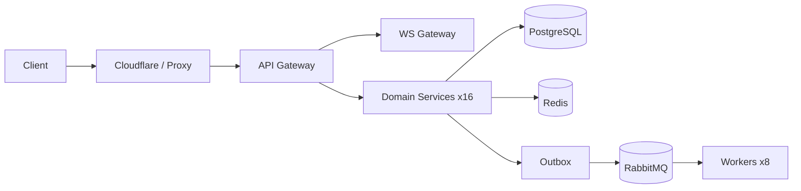

# Nestlancer Backend API

Production NestJS monorepo for the Nestlancer platform. It includes one API gateway, one WebSocket gateway, 16 domain microservices, and 8 workers running on RabbitMQ-driven asynchronous flows.

## Table of Contents

- [Project Analysis](#project-analysis)
- [System Architecture](#system-architecture)
- [Tech Stack](#tech-stack)
- [Required Local Toolchain](#required-local-toolchain)
- [Environment and Secrets (Infisical)](#environment-and-secrets-infisical)
- [Run Locally (Development)](#run-locally-development)
- [Dev VPS Public Access](#dev-vps-public-access-dev-apinestlancercom)
- [Docker and Production Compose](#docker-and-production-compose)
- [Release Images to GHCR](#release-images-to-ghcr)
- [Deploy to VPS (Compose)](#deploy-to-vps-compose)
- [Deploy to VPS (K3s)](#deploy-to-vps-k3s)
- [Key Commands](#key-commands)
- [Service Inventory](#service-inventory)
- [API Contract Docs](#api-contract-docs)
- [Beginner Guide](#beginner-guide)
- [Operator Runbook (Day-2 Ops)](#operator-runbook-day-2-ops)
- [Troubleshooting](#troubleshooting)

## Project Analysis

This backend is designed as a domain-separated distributed monorepo.

- **Strengths**
  - Clear service boundaries (`services/*`) and worker separation (`workers/*`)
  - Event-driven integration via outbox + RabbitMQ for decoupled cross-service workflows
  - Repeatable production image pipeline (`.github/workflows/build-images.yml`)
  - Dual deployment modes already implemented (Docker Compose and K3s)
  - Centralized secrets model through Infisical (`.env.infisical`)
- **Operational implications**
  - Local development needs infra dependencies (PostgreSQL, Redis, RabbitMQ, Mailpit)
  - Production deploy needs explicit secret and migration discipline
  - Image tag consistency (`NESTLANCER_IMAGE_TAG`) is critical across all 26 images

## System Architecture

```text
                    +---------------------+
                    |  Cloudflare / TLS   |
                    +----------+----------+
                               |
Client/Browser --------------- v ------------------------------+
                    +---------------------+                    |
                    |     API Gateway     |                    |
                    +----+-----------+----+                    |
                         |           |                         |
                         |           +--> WS Gateway           |
                         |                (Socket.IO)          |
                         v                                     |
               +---------------------+                         |
               | Domain Services x16 |                         |
               +----+-----------+----+                         |
                    |           |                              |
                    |           +--> PostgreSQL / Redis        |
                    v                                          |
              +----------------+      +------------------+     |
              | Outbox Events  +----->+ RabbitMQ Queues  +-----+
              +----------------+      +---------+--------+
                                               |
                                               v
                                       +---------------+
                                       | Workers x8    |
                                       +---------------+
```

High-level runtime components:

- `gateway/` for REST, auth guard composition, API contract exposure, and envelope responses
- `ws-gateway/` for socket-based real-time channels
- `services/` (16 bounded services): `auth`, `users`, `requests`, `quotes`, `projects`, `progress`, `payments`, `messaging`, `notifications`, `media`, `portfolio`, `blog`, `contact`, `admin`, `webhooks`, `health`
- `workers/` (8 processors): `analytics-worker`, `audit-worker`, `cdn-worker`, `email-worker`, `media-worker`, `notification-worker`, `outbox-poller`, `webhook-worker`
- `libs/` shared platform modules for config, transport, auth, queue, tracing, and common contracts



## Tech Stack

- Node.js 20+, TypeScript 5+, NestJS 10
- Prisma 7 + PostgreSQL
- Redis + RabbitMQ
- pnpm workspaces + Turborepo
- Docker Compose (dev/prod) and K3s support
- GitHub Actions for CI and CD
- Infisical for secret lifecycle and deploy-time export

## Required Local Toolchain

`pnpm install` installs Node dependencies only. You must install infrastructure and platform tools manually.

### Mandatory

- `git` (version control)
- `node` `>=20.19.0`
- `pnpm` `>=9`
- `docker` (Engine/Desktop)
- `docker compose` plugin
- `bash`, `curl`, `openssl`
- `make` (recommended command wrapper)

### Mandatory for this repository workflow

- `infisical` CLI (for `.env.infisical` generation and CI/CD parity)

### Optional but recommended

- `kubectl` (for K3s mode)
- `k3s` / `helm` (if you deploy Kubernetes on VPS)
- `jq` (ops scripting convenience)

## Environment and Secrets (Infisical)

This project uses Infisical as the source of truth for environment variables.

- `dev` environment -> local docker and dev VPS
- `production` environment -> production compose and production k3s
- local runtime file used by scripts: `.env.infisical` (generated, gitignored)

One-time setup:

```bash
infisical init
infisical login
infisical export --env=dev --format=dotenv > .env.infisical
chmod 600 .env.infisical
```

Reference templates:

- `.env.production.example`
- `docs/guides/infisical.md`

## Run Locally (Development)

### 1) Install and bootstrap

```bash
pnpm install
pnpm db:generate
```

### 2) Start infrastructure

```bash
pnpm docker:up
```

This starts the **core** app containers from `docker-compose.dev.yml` with a **Caddy** reverse-proxy overlay (`docker-compose.local.yml`) via `scripts/docker/compose-dev.sh`. Every container has hard mem/CPU limits. Workers are opt-in (`pnpm docker:up:workers` / `pnpm docker:up:full`) — prefer core-only on ≤12GB VPS.

Caddy listens on host ports `80` and `443`, routes `/` to `gateway:3000` and `/ws` to `ws-gateway:3100`, and obtains a Let's Encrypt certificate when `DEV_API_HOST` points at the server.

```bash
# optional overrides (defaults shown)
export DEV_API_HOST=dev-api.nestlancer.com
export LETSENCRYPT_EMAIL=ops@nestlancer.com
pnpm docker:up
```

Verify routing:

```bash
pnpm docker:verify:dev-host
pnpm docker:proxy:logs
```

On a **dev VPS** with a public IP, also complete [Dev VPS public access](#dev-vps-public-access-dev-apinestlancercom) (DNS + UFW Docker rules). Without those, browsers time out even when containers are healthy.

### 3) Run local migration and seed (if needed)

The seed calls the running services, so do this after `pnpm docker:up`.

```bash
pnpm db:migrate
bash seed/seed.sh --env=dev --phase=core,content
# Full wipe plus demo clients: bash seed/seed.sh --env=dev
```

### 4) Run all services in watch mode

```bash
pnpm dev
```

### 5) Verify

```bash
curl http://localhost:3000/api/v1/health/live
```

Useful UIs:

- RabbitMQ: `http://localhost:15672`
- Mailpit: `http://localhost:8025`

## Dev VPS public access (`dev-api.nestlancer.com`)

Use this when the dev stack runs on a VPS (Hetzner/HostAsia) and clients reach it over the internet—not only on `localhost`.

### Architecture (current dev path)

```text
Internet -> VPS :80/:443 (Caddy in nl-dev-proxy)
         -> gateway:3000 / ws-gateway:3100 (Docker network)
```

K3s/Traefik is **not** required for daily dev on a VPS. Production may still use K3s or compose separately.

### One-time VPS checklist

1. **DNS** — `dev-api.nestlancer.com` A record → VPS public IPv4 (grey cloud / DNS-only is fine for direct LE; orange cloud needs origin reachable).
2. **Provider firewall** — allow inbound TCP `80` and `443` from `0.0.0.0/0` (Hetzner Cloud Firewall attached to this server).
3. **UFW** — allow HTTP/HTTPS:
   ```bash
   ufw allow 80/tcp
   ufw allow 443/tcp
   ufw reload
   ```
4. **UFW + Docker (critical)** — default UFW Docker integration drops **new** forwarded traffic to container networks (`172.16.0.0/12`). Published ports `80`/`443` then accept SYNs but never return SYN-ACK. Add **before** the `ufw-docker-logging-deny` rules in `/etc/ufw/after.rules` inside the `# BEGIN UFW AND DOCKER` block:
   ```text
   -A DOCKER-USER -p tcp -m tcp --dport 80 -j RETURN
   -A DOCKER-USER -p tcp -m tcp --dport 443 -j RETURN
   ```
   Then:
   ```bash
   ufw reload
   docker restart nl-dev-proxy
   ```
5. **Start stack** — from repo root on VPS:
   ```bash
   pnpm docker:up
   # wait ~60s for gateway watch compile, then:
   pnpm docker:verify:dev-host
   ```

### Verify from your laptop (not SSH)

```bash
curl -v --connect-timeout 10 https://dev-api.nestlancer.com/api/v1/health/live
curl -v --connect-timeout 10 https://dev-api.nestlancer.com/docs
```

Expected: TLS handshake succeeds and HTTP `200` (health JSON / Swagger HTML).

### Diagnose connection timeouts

| Symptom                                                          | Likely cause                                                                |
| ---------------------------------------------------------------- | --------------------------------------------------------------------------- |
| `curl` from laptop times out; `curl` on VPS to `127.0.0.1` works | UFW `DOCKER-USER` drop (see step 4) or provider firewall                    |
| tcpdump shows `SYN` from client IP, no `SYN-ACK` from VPS        | Same as above — not an application bug                                      |
| Let's Encrypt "Timeout during connect" in Caddy logs             | Origin `80`/`443` not reachable from internet (often same UFW Docker issue) |
| `502` from Caddy shortly after `docker:up`                       | Gateway still compiling — wait and retry                                    |

Packet capture while reproducing from laptop:

```bash
sudo tcpdump -ni eth0 'tcp port 80 or tcp port 443'
```

If you see inbound `SYN` from your IP with no reply, fix firewall/UFW before changing app code.

## Docker and Production Compose

Production compose file is generated from workload manifest and expects pre-built images by default:

- Compose file: `docker-compose.prod.yml`
- Generator: `scripts/docker/generate-prod-compose.mjs`
- Wrapper: `scripts/docker/compose-prod.sh`

Key runtime environment variables:

- `NESTLANCER_IMAGE_REGISTRY` (for example `ghcr.io/<org>`)
- `NESTLANCER_IMAGE_TAG` (for example `v1.2.3` or `latest`)

## Release Images to GHCR

Workflow: `.github/workflows/build-images.yml`

- Trigger: GitHub release `published`, tag `v*.*.*`, or manual dispatch
- Output: **28** runtime images pushed to `ghcr.io/<owner>/<image-id>:<tag>`
- Build model: one monorepo Dockerfile + Bake (`docker/prod-monorepo/`) — shared compile, then gateways → services → workers
- Auth: built-in `GITHUB_TOKEN` with `packages: write`

Release flow:

1. Create release tag (for example `v1.0.0`)
2. Publish release / push tag
3. Wait for **Build Production Images** (phased bake + GHA cache)
4. Verify packages exist in GitHub Packages

Manual local build (progress bar + ETA; interrupt-safe via buildx builder + `.cache/docker-buildkit`):

```bash
export NESTLANCER_IMAGE_REGISTRY=ghcr.io/<org>
export NESTLANCER_IMAGE_TAG=v1.0.0

# Prefer these for day-to-day work (keep BuildKit cache — do not prune it)
pnpm docker:prod:build:one service auth                 # one image (~1 min warm)
pnpm docker:prod:build:affected                         # turbo-changed only
./scripts/docker/build-group-prod-images.sh gateways    # one group

# Full bake only when needed (cold: 45–70 min)
pnpm docker:prod:build
```

Do **not** wipe `.cache/docker-buildkit` or run `docker builder prune -af` between iterations. Details: `docs/guides/prod-deployment.md`.

## Deploy to VPS (Compose)

Automated production deploy workflow: `.github/workflows/cd-production.yml`

What it does:

1. SSH to VPS
2. Pull latest main
3. Login to Infisical via Universal Auth
4. Export `.env.infisical`
5. Run migration script
6. Pull GHCR images (if registry secret exists) or build on VPS fallback
7. Run `compose-prod.sh up -d`
8. Run smoke health checks

Required GitHub secrets:

- `PRODUCTION_VPS_HOST`
- `PRODUCTION_VPS_USERNAME`
- `PRODUCTION_VPS_PASSWORD`
- `PRODUCTION_VPS_DEPLOY_PATH` (optional)
- `INFISICAL_CLIENT_ID`
- `INFISICAL_CLIENT_SECRET`
- `INFISICAL_PROJECT_ID` (optional if `.infisical.json` exists on VPS)
- `NESTLANCER_IMAGE_REGISTRY` (required for pull-based deploy)

Manual VPS deploy:

```bash
INFISICAL_ENV=production ./scripts/docker/compose-prod.sh pull
INFISICAL_ENV=production ./scripts/docker/compose-prod.sh up -d
GATEWAY_URL=http://127.0.0.1:3000 ./scripts/deploy/smoke-health.sh
```

## Deploy to VPS (K3s)

K3s is supported as a first-class path for production.

1. Set registry in `scripts/docker/workloads.manifest.json`
2. Generate manifests: `pnpm k3s:generate`
3. Create GHCR image pull secret in cluster
4. Apply overlay in `deploy/k3s/overlays/production`

Main script: `scripts/deploy/k3s-deploy.sh`

## Key Commands

- `pnpm dev` - run all apps in watch mode via Turborepo
- `pnpm build` - build all packages
- `pnpm test` - run all tests
- `pnpm lint` - lint all packages
- `pnpm db:migrate` - Prisma migration for local development
- `pnpm db:seed` - seed core config, blogs, and portfolio (`bash seed/seed.sh --env=dev --phase=core,content`)
- `pnpm docker:up` - start core stack (SSH-safe default; includes Caddy on 80/443)
- `pnpm docker:up:workers` / `pnpm docker:up:full` - add workers / core+workers
- `pnpm docker:down` / `pnpm docker:down:core` / `pnpm docker:down:workers` - stop full / core / workers
- `pnpm docker:verify:dev-host` - local + public checks for `dev-api.nestlancer.com`
- `pnpm docker:proxy:logs` - Caddy (`nl-dev-proxy`) logs
- `pnpm docker:prod:build` - build all production images locally (phased + progress/ETA; cold ~45–70 min)
- `pnpm docker:prod:build:one` - build one production image (`service auth`, `gateway`, `worker email-worker`, …)
- `pnpm docker:prod:build:affected` - build turbo-affected production images only (preferred for iteration)
- `pnpm docker:prod:up` / `pnpm docker:prod:down` - production compose lifecycle
- `pnpm k3s:generate` - regenerate Kubernetes manifests

## Service Inventory

Image IDs used in GHCR and compose:

- Gateways: `gateway`, `ws-gateway`
- Services: `auth`, `users`, `payments`, `webhooks`, `admin`, `requests`, `quotes`, `projects`, `progress`, `messaging`, `notifications`, `media`, `portfolio`, `blog`, `contact`, `health`
- Workers: `analytics-worker`, `audit-worker`, `cdn-worker`, `email-worker`, `media-worker`, `notification-worker`, `outbox-poller`, `webhook-worker`

## API Contract Docs

- Runtime merged spec: `GET /docs-all-json`
- Local Swagger UI: `http://localhost:3000/api/docs`
- Committed spec: `docs/api/openapi-merged.json`
- OpenAPI tooling docs: `scripts/openapi/README.md`

## Beginner Guide

For a full beginner-first walkthrough (local setup, GHCR release, VPS deploy, rollback), use:

- `STEP_BY_STEP_GUIDE.md`

## Operator Runbook (Day-2 Ops)

### A) Rapid Incident Triage (first 10 minutes)

- [ ] Confirm blast radius (single route, single service, or full platform)
- [ ] Check gateway health: `curl http://127.0.0.1:3000/api/v1/health/live`
- [ ] Check compose status: `pnpm docker:prod:ps`
- [ ] Review recent deploy and image tag (`NESTLANCER_IMAGE_TAG`)
- [ ] Tail gateway logs first, then failing service logs

### B) Log Triage Sequence

```bash
# 1) Platform-level view
pnpm docker:prod:logs

# 2) Narrow to a service (example)
docker compose -f docker-compose.prod.yml logs -f --tail=200 svc-payments

# 3) Gateway edge errors
docker compose -f docker-compose.prod.yml logs -f --tail=200 gateway
```

Checklist:

- [ ] correlate by timestamp
- [ ] locate first upstream failure, not only secondary errors
- [ ] verify env-dependent values (`DATABASE_URL`, `RABBITMQ_URL`, `REDIS_URL`)
- [ ] verify dependency availability (DB, Redis, RabbitMQ)

### C) Rollback Procedure (Compose)

```bash
cd /root/nestlancer-backend-api
COMPOSE_FILE=docker-compose.prod.yml ./scripts/deploy/rollback.sh <previous-sha>
pnpm docker:prod:ps
GATEWAY_URL=http://127.0.0.1:3000 ./scripts/deploy/smoke-health.sh
```

- [ ] rollback application containers
- [ ] validate health and key user flows
- [ ] document exact failing SHA, rollback SHA, and impact

### D) Incident Closure Checklist

- [ ] root cause identified and documented
- [ ] mitigation completed (rollback or hotfix)
- [ ] monitoring/alert gaps documented
- [ ] follow-up issue created for permanent fix
- [ ] post-incident summary shared with team

## Troubleshooting

- If compose deploy falls back to build on VPS, check `NESTLANCER_IMAGE_REGISTRY` is set in workflow secrets.
- If image pull fails, verify GHCR package visibility and VPS `docker login ghcr.io`.
- If env variables appear stale, regenerate `.env.infisical` from Infisical and recreate affected containers.
- If health checks fail post deploy, inspect gateway and dependency service logs first (`pnpm docker:prod:logs`).
- If `dev-api.nestlancer.com` times out in the browser but `pnpm docker:verify:dev-host` passes only local checks, apply [UFW Docker rules](#dev-vps-public-access-dev-apinestlancercom) and confirm provider firewall allows `80`/`443`.
- If Caddy cannot obtain a certificate, ensure Let's Encrypt can reach `http://<your-host>/.well-known/acme-challenge/` on port 80 from the public internet (not just from inside the VPS).
- Legacy host-level Nginx guides (`docs/guides/nginx.md`) are for compose-only production fallback—not the default dev Docker path (Caddy in `docker-compose.local.yml`).

---

License: MIT. See `LICENSE`.
