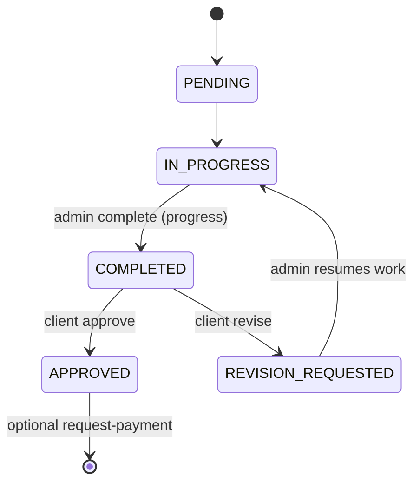

## 📖 Table of Contents

- [Context](#context)
- [Milestone states](#milestone-states)
- [Canonical admin flows](#canonical-admin-flows)
- [Project status vs milestone status](#project-status-vs-milestone-status)
- [Client constraints](#client-constraints)
- [Consequences](#consequences)

---

## Context

A single `Milestone` row is shared by delivery (progress), client approval, and payments. Historically three admin actions all set `status = COMPLETED` with different outbox events, which confused operators.

---

## Milestone states

| Status               | Meaning                             | Who sets it                                             |
| :------------------- | :---------------------------------- | :------------------------------------------------------ |
| `PENDING`            | Scheduled, not started              | System on create                                        |
| `IN_PROGRESS`        | Work underway                       | Admin / automation                                      |
| `COMPLETED`          | Work done; awaiting client approval | **Progress** `POST /admin/milestones/:id/complete`      |
| `APPROVED`           | Client accepted                     | Client `POST /progress/milestones/:id/approve`          |
| `REVISION_REQUESTED` | Client asked for changes            | Client `POST /progress/milestones/:id/request-revision` |

Payment collection is orthogonal: `POST /admin/milestones/:id/request-payment` creates or reuses a `Payment` and emits `PAYMENT_REQUESTED`. It does **not** change milestone delivery status.

### Payment gating (enforced in API)

| Milestone                | Client may pay when                                                   |
| :----------------------- | :-------------------------------------------------------------------- |
| Deposit (lowest `order`) | Anytime after quote accept while payment is open                      |
| Later milestones         | `APPROVED`, or admin has requested payment (`paymentRequestedAt` set) |

Admin **request payment** requires milestone `APPROVED`. Admin **submit for approval** is blocked until deposit is `COMPLETED` when project is `PENDING_PAYMENT`.

### Review window

When admin completes delivery (`COMPLETED`), `reviewDeadlineAt` is set (`APPROVAL_WINDOW_DAYS`, default 7). If the client does not approve or request revision before the deadline, a scheduler deems the milestone `APPROVED`.

---

## Canonical admin flows

### Delivery completion (one path)

- **Use:** `POST /api/v1/admin/milestones/:id/complete` (progress service)
- **UI:** Admin project detail → “Submit for client approval”
- **Outbox:** `MILESTONE_COMPLETED`

### Payment request (separate)

- **Use:** `POST /api/v1/admin/payments/milestones/:id/request-payment` (payments service)
- **UI:** Admin payments → “Request payment” (after client approval when amount is due)
- **Outbox:** `PAYMENT_REQUESTED`

### Deprecated

- `POST /api/v1/admin/payments/milestones/:id/mark-complete` — duplicates progress complete; kept for backward compatibility but must not be used from new UI. Prefer progress `complete`.

---

## Project status vs milestone status

- **Project** lifecycle: `PATCH /api/v1/admin/projects/:id/status` (projects service).
- **Progress summary** for clients: `GET /api/v1/progress/projects/:id/status` → `percentageComplete`, `currentPhase` (derived from milestones).

Do not use `PATCH /api/v1/admin/progress/projects/:id/status` for new work; it mirrors projects and remains for legacy clients only.

---

## Client constraints

- Clients must not `POST /projects/:id/progress` (create entry); only admins post timeline updates.
- Clients approve/revise only when milestone `status === COMPLETED`.

---

## Consequences

- Admin payments UI uses progress `complete` for delivery handoff, not payments `mark-complete`.
- Payments `mark-complete` emits the same outbox type as progress for consumers that still call it.
