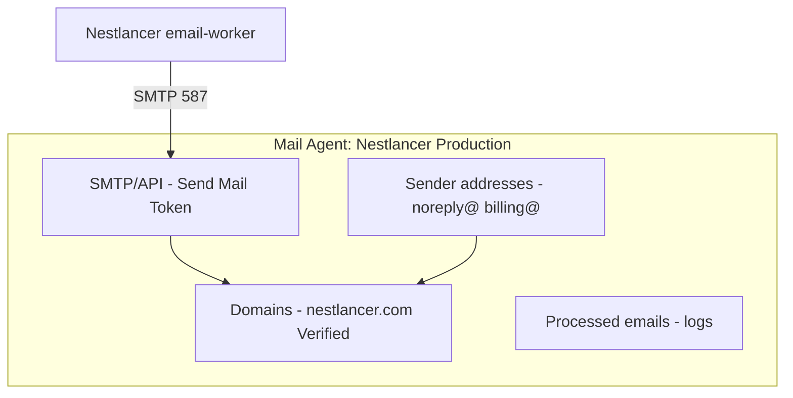

# Zoho Mail + ZeptoMail setup guide (Nestlancer)

Step-by-step guide to set up **human inboxes** (Zoho Mail) and **transactional sending** (ZeptoMail) for `nestlancer.com`, aligned with the Nestlancer email architecture.

## Nestlancer Zoho account (your setup)

Use this account to sign in to **Zoho Mail**, **ZeptoMail**, and the [Admin Console](https://mailadmin.zoho.com/). It is your personal Zoho ID — not a public business mailbox.

| Field                         | Value                            |
| ----------------------------- | -------------------------------- |
| **Zoho signup / login email** | `bhumukulraj.Official@gmail.com` |
| **Organization name**         | Nestlancer                       |
| **Domain**                    | `nestlancer.com`                 |
| **Primary business mailbox**  | `Nestlancer@nestlancer.com`      |

### Primary mailbox: `Nestlancer@nestlancer.com`

Create this as the **first user** in Zoho Mail after domain verification (Step A7). That user becomes the **Super Administrator** by default.

| Setting           | Recommended value                                     |
| ----------------- | ----------------------------------------------------- |
| Email address     | `Nestlancer@nestlancer.com`                           |
| Display name      | Nestlancer                                            |
| Role              | Super Administrator                                   |
| Recovery / notify | `bhumukulraj.Official@gmail.com` (Zoho account email) |

**Use `Nestlancer@nestlancer.com` for:**

- Official outbound mail from the team (sales, partnerships, general inquiries)
- Zoho Mail web/app login at [mail.zoho.com](https://mail.zoho.com/)
- Optional aliases: `hello@`, `info@` → forward to `Nestlancer@`

**Keep using separate role mailboxes** (`contact@`, `support@`, `billing@`) for automated routing and the Nestlancer app — see section 2.

**Which plan to buy?** → See **section 3**. **Cheap budget:** Forever Free (₹0) if India offers it → else **Mail Lite 5 GB × 1 user** (~₹700/year + GST).

---

**Official references**

- [Zoho Mail — complete setup guide](https://www.zoho.com/mail/complete-guide-to-setup-zohomail.html)
- [Zoho Mail — add domain (Admin Console)](https://www.zoho.com/mail/help/adminconsole/add-domains.html)
- [Zoho Mail — SPF](https://www.zoho.com/mail/help/adminconsole/spf-configuration.html)
- [Zoho Mail — DKIM](https://www.zoho.com/mail/help/adminconsole/dkim-configuration.html)
- [ZeptoMail — getting started](https://www.zoho.com/zeptomail/help/getting-started.html)
- [ZeptoMail — domains & verification](https://www.zoho.com/zeptomail/help/domains.html)
- [ZeptoMail — SMTP](https://www.zoho.com/zeptomail/help/smtp-home.html)
- [ZeptoMail + Zoho Mail on same domain (SPF note)](https://www.zoho.com/blog/zeptomail/spf-removal.html)

---

## 1. Two products, one domain

| Product       | Purpose for Nestlancer                      | Examples                                          |
| ------------- | ------------------------------------------- | ------------------------------------------------- |
| **Zoho Mail** | Real mailboxes — people read, reply, thread | `Nestlancer@`, `contact@`, `support@`, `billing@` |
| **ZeptoMail** | App sends automated mail (API/SMTP only)    | `noreply@`, `billing@` as **FROM** for receipts   |

```mermaid
flowchart LR
  subgraph app [Nestlancer backend]
    EW[email-worker]
  end

  subgraph zepto [ZeptoMail — send only]
    NR[noreply@nestlancer.com]
    BL[billing@nestlancer.com]
  end

  subgraph zoho [Zoho Mail — inboxes]
    NL[Nestlancer@nestlancer.com]
    CT[contact@nestlancer.com]
    SUP[support@nestlancer.com]
    BILL[billing@nestlancer.com]
  end

  EW -->|SMTP| zepto
  Users -->|reply / write| zoho
  CT --> Admin[Admin team]
  SUP --> Admin
  BILL --> Admin
```

**Rule:** If a human might reply → **Zoho Mail**. If it is OTP, receipt, alert, auto-ack → **ZeptoMail**.

---

## 2. Accounts to create (checklist)

### Zoho Mail — mailboxes (inboxes)

Create these **users** or **group aliases** in [Zoho Mail Admin Console](https://mailadmin.zoho.com/):

| Address                       | Type                                  | Who uses it                                                | Nestlancer role                                          |
| ----------------------------- | ------------------------------------- | ---------------------------------------------------------- | -------------------------------------------------------- |
| **Nestlancer@nestlancer.com** | User (create **first** — Super Admin) | Founder / primary admin (`bhumukulraj.Official@gmail.com`) | Official brand inbox; org admin for Zoho                 |
| **contact@nestlancer.com**    | User or group inbox                   | Sales / ops                                                | Public `/contact` form notifications land here           |
| **support@nestlancer.com**    | User or shared inbox                  | Support admins                                             | Reply-To on transactional mail; external support email   |
| **billing@nestlancer.com**    | User or shared inbox                  | Finance                                                    | Payment questions; optional Reply-To on billing emails   |
| **ops@nestlancer.com**        | User (optional)                       | DevOps                                                     | Infra alerts only (certs, monitoring) — not product mail |

**Do not** create Zoho mailboxes for:

| Address                  | Why                                                    |
| ------------------------ | ------------------------------------------------------ |
| `noreply@nestlancer.com` | Send-only via ZeptoMail — nobody reads this inbox      |
| `admin@nestlancer.com`   | App login account in Nestlancer DB, not an email inbox |

### ZeptoMail — sender addresses (verified senders)

In ZeptoMail → your **Mail Agent** → **Sender addresses**, add and verify:

| Sender                     | Used as FROM in app                               | Notes                                         |
| -------------------------- | ------------------------------------------------- | --------------------------------------------- |
| **noreply@nestlancer.com** | Auth, quotes, projects, contact auto-ack, digests | Primary transactional sender                  |
| **billing@nestlancer.com** | Payment requested, receipt, failed, refund        | Better trust than `noreply@` for money emails |

ZeptoMail does **not** replace Zoho for `contact@` / `support@` inboxes — it only **sends** mail. Incoming mail to those addresses is handled by **Zoho Mail MX records**.

---

## 3. Recommended Zoho Mail plan (for this project)

**Short answer for a cheap budget:** Yes — this is a good, low-cost setup. You do **not** need Workplace or Premium. Use **1 mailbox + free groups** so you pay for one seat, not four. Target **₹0** (Forever Free) or **~₹700–900/year** (Mail Lite 5 GB, 1 user, India annual) + GST. ZeptoMail can stay on **trial credits** until customer validation passes.

### Cheapest path (do this order)

| Step | What                                                                                                   | Approx. cost (India)                                              |
| ---- | ------------------------------------------------------------------------------------------------------ | ----------------------------------------------------------------- |
| 1    | Sign up with `bhumukulraj.Official@gmail.com`, India DC                                                | ₹0                                                                |
| 2    | If console shows **Forever Free** → use it (5 users, 5 GB, webmail only)                               | **₹0 / year**                                                     |
| 3    | If no free plan → **Mail Lite 5 GB**, **1 user**, billed **annually**                                  | **~₹59/user/month** → **~₹708/year** (+ 18% GST ≈ **~₹835/year**) |
| 4    | Add **groups** only (no extra licenses): `contact@`, `support@`, `billing@` → deliver to `Nestlancer@` | ₹0 extra                                                          |
| 5    | ZeptoMail: trial + validation first; buy credits only when app email volume needs it                   | ₹0 at start, then pay-as-you-go                                   |

**Skip to save money:** Workplace (₹99+/user/mo), Mail Premium (₹199+/user/mo), 4 separate user mailboxes, monthly billing (annual is cheaper).

**5 GB vs 10 GB:** For a solo founder and mostly in-app chat, **5 GB is enough** and saves about **₹192/year** per user vs 10 GB (₹59 vs ₹75/user/month in India). Upgrade to 10 GB later if the inbox fills up.

---

This recommendation is based on how **Nestlancer** actually uses email today (see `docs/email-implementation-summary.md`, `email-report2.md`, and the backend `email-worker`):

| Project fact                                                                     | Impact on Zoho Mail choice                                                                                                                         |
| -------------------------------------------------------------------------------- | -------------------------------------------------------------------------------------------------------------------------------------------------- |
| **Studio model** — clients talk to admin in-app, not email-to-email              | Low volume on `support@` / `billing@`; in-app chat is primary                                                                                      |
| **ZeptoMail** sends verification, payments, contact auto-ack, etc.               | Do **not** count those as Zoho Mail users — they are SMTP send-only                                                                                |
| **4 human-facing addresses** — `Nestlancer@`, `contact@`, `support@`, `billing@` | Need groups or 2–4 **licensed users**, not 10                                                                                                      |
| **Small team** (founder + optional ops/finance)                                  | 1–3 paid mailboxes is enough in year 1                                                                                                             |
| **India production** (`ZEPTOMAIL_DC=in`)                                         | Sign up on [Zoho Mail India pricing](https://www.zoho.com/en-in/mail/zohomail-pricing.html); pick **India data center** at org creation (one-time) |
| **Transactional mail ≠ Zoho Mail**                                               | ZeptoMail is a **separate** product and bill (credits) — not included in any Mail plan                                                             |

**Pricing reference (check live on Zoho — amounts vary by region and billing):**

- [Zoho Mail pricing (India)](https://www.zoho.com/en-in/mail/zohomail-pricing.html)
- [Zoho Mail subscription & mix-and-match](https://www.zoho.com/mail/help/adminconsole/subscription.html)

---

### Recommended choice (paid): **Mail Lite — 5 GB or 10 GB** (annual)

**Best paid fit for Nestlancer.** Pick **5 GB** if budget is tight; **10 GB** if you want extra headroom for attachments (~₹16/user/month more in India).

| Why this plan          | Detail                                                                                                                                   |
| ---------------------- | ---------------------------------------------------------------------------------------------------------------------------------------- |
| Email-only             | You already run the product on your own stack; you do not need Workplace’s Writer/Sheet/Cliq unless you want to replace Google Workspace |
| Enough storage         | 10 GB/user handles contact-form threads, PDFs, and payment replies better than 5 GB                                                      |
| IMAP/POP + mobile apps | Useful for `Nestlancer@` and `support@` on phone/desktop mail clients                                                                    |
| Custom domain + groups | Supports `contact@`, `support@`, `billing@` as **groups** without buying a license per alias                                             |
| Cost-effective         | Typically the lowest **paid** tier per user (often ~**$1.25 USD/user/month** billed annually for 10 GB — confirm on India pricing page)  |

**How many users to buy (licenses)**

Zoho bills per **user mailbox**, not per group alias. Use groups to avoid paying for four full users on day one.

| Phase                                  | Licensed users | Setup                                                                                                                                                  |
| -------------------------------------- | -------------- | ------------------------------------------------------------------------------------------------------------------------------------------------------ |
| **Now (solo founder)**                 | **1 user**     | `Nestlancer@nestlancer.com` only. Create **groups** `contact@`, `support@`, `billing@` with you as the only member → all role mail lands in one inbox. |
| **When someone joins support/finance** | **2 users**    | Add a real mailbox for a teammate; add them to `support@` / `billing@` groups.                                                                         |
| **Small team (3–5 people)**            | **3–5 users**  | One mailbox per person who logs into Zoho; keep groups for shared addresses.                                                                           |

**Rough annual cost (India, billed annually — add ~18% GST):**

| Plan                | Users | Approx. / year (INR)\*                               |
| ------------------- | ----- | ---------------------------------------------------- |
| Forever Free        | 1–5   | **₹0**                                               |
| Mail Lite **5 GB**  | 1     | **~₹708** (~₹835 with GST)                           |
| Mail Lite **5 GB**  | 2     | **~₹1,416**                                          |
| Mail Lite **10 GB** | 1     | **~₹900** (~₹1,062 with GST)                         |
| Workplace Standard  | 1     | **~₹1,188+** — **avoid** unless you need office apps |

\*Confirm on [Zoho Mail India pricing](https://www.zoho.com/en-in/mail/zohomail-pricing.html). USD ballpark: 5 GB ≈ **$12/user/year**, 10 GB ≈ **$15/user/year**.

**Signup steps for this plan**

1. Sign up with **`bhumukulraj.Official@gmail.com`** → choose **India** data center if prompted.
2. Start the **15-day free trial** (highest edition) if offered — no card required.
3. Add domain `nestlancer.com`, verify DNS, add MX (Part A).
4. Before trial ends: Admin Console → **Subscription** → **Mail Lite 5 GB** (cheapest paid) or **10 GB**, **1 user** only.
5. Create `Nestlancer@` → then **Groups** for `contact@`, `support@`, `billing@` (Step A7).

---

### Budget option: **Forever Free** (only if available in your region)

Zoho offers a **Forever Free** plan: **up to 5 users**, **one domain**, **5 GB/user**, **web-only** (no IMAP/POP/ActiveSync). Groups are supported.

| Good for Nestlancer if…                                      | Limitations                                                                             |
| ------------------------------------------------------------ | --------------------------------------------------------------------------------------- |
| You want **₹0** mail hosting to start                        | **Not available in all data centers** — if India signup does not show it, use Mail Lite |
| 1–5 people and webmail is enough                             | No Outlook/Apple Mail via IMAP unless you upgrade                                       |
| Same group trick: 1–2 real users + groups for role addresses | If you outgrow 5 users or need IMAP → must upgrade **whole org** to paid                |

**Practical advice:** Try Forever Free at signup. If the India console only offers paid plans, use **Mail Lite 10 GB × 1 user** — still very low cost.

---

### Plans we do **not** recommend yet

| Plan                                  | Why skip for now                                                                                                                                     |
| ------------------------------------- | ---------------------------------------------------------------------------------------------------------------------------------------------------- |
| **Mail Premium**                      | eDiscovery, retention, S/MIME — useful for regulated enterprises; Nestlancer does not need this until compliance or legal hold is required           |
| **Workplace Standard / Professional** | Pays for Office suite, Cliq, WorkDrive — only choose if you **intentionally** replace Google Workspace / Slack with Zoho apps                        |
| **Mix-and-match**                     | Helpful when some staff need Premium and others Lite — overkill until the team is larger; contact `sales@zohocorp.com` when you have 10+ mixed roles |

**Upgrade triggers (revisit in 12–18 months)**

- Move **`support@` owner** to **Mail Premium** if you need email archiving/eDiscovery for disputes.
- Move to **Workplace Standard** if the team standardizes on Zoho Writer/Sheet/Meet instead of Google.
- Add **Mail Premium** for **billing@** if finance needs long retention for tax/audit.

---

### ZeptoMail (separate from Zoho Mail plan)

| Product       | Billing                                                     | Nestlancer need                                      |
| ------------- | ----------------------------------------------------------- | ---------------------------------------------------- |
| **Zoho Mail** | Per user / month (plans above)                              | Human inboxes                                        |
| **ZeptoMail** | **Credits** (e.g. 10k emails per credit, ~6 month validity) | App transactional sends from `noreply@` / `billing@` |

Do not buy Workplace “for email” thinking it replaces ZeptoMail — configure ZeptoMail separately (Part B).

**Suggested ZeptoMail spend:** start with **trial + customer validation**, then buy **1 credit** after go-live; scale credits with registration/payment volume (see [ZeptoMail pricing](https://www.zoho.com/zeptomail/pricing.html)).

---

### Decision summary (copy this)

| Question                  | Answer for Nestlancer                                                                        |
| ------------------------- | -------------------------------------------------------------------------------------------- |
| Which Zoho Mail plan?     | **Forever Free** if available; else **Mail Lite 5 GB** (budget) or **10 GB** (extra storage) |
| How many users at launch? | **1** (`Nestlancer@`) + **3 groups** — saves 3× license cost                                 |
| Is it cheap enough?       | **Yes** — ~₹0–835/year for all human inboxes vs ₹4k+ for Workplace                           |
| Workplace bundle?         | **No** (unless you want Zoho office apps)                                                    |
| Mail Premium?             | **No** (until compliance/archiving needed)                                                   |
| ZeptoMail?                | **Yes**, separate — required for the app to send mail                                        |

---

## 4. Prerequisites

Before you start:

1. **Domain:** `nestlancer.com` (or your production domain).
2. **DNS access:** Cloudflare, Route53, GoDaddy, Namecheap, etc. — same place MX/TXT/CNAME are managed.
3. **Zoho account:** Sign in with **`bhumukulraj.Official@gmail.com`** — one Zoho ID for Zoho Mail and ZeptoMail.
4. **Nestlancer region:** Production uses **India** ZeptoMail (`smtp.zeptomail.in`, `ZEPTOMAIL_DC=in`). Sign up on the India ZeptoMail site if applicable: [zeptomail.zoho.in](https://www.zoho.com/zeptomail/).

---

## Part A — Zoho Mail setup (inboxes)

### Step A1 — Sign up and create organization

1. Go to [Zoho Mail](https://www.zoho.com/mail/) → **Sign up** / **Get started**.
2. Sign up or log in with: **`bhumukulraj.Official@gmail.com`** (verify via Gmail OTP if asked).
3. Choose plan per **section 3**: **Mail Lite 10 GB** (recommended), or Forever Free if offered in India.
4. Enter organization name: **Nestlancer**.
5. Add domain: **nestlancer.com** → **Add**.
6. Complete phone verification (mobile OTP) when prompted.

If you already signed up with this Gmail on other Zoho apps, open Admin Console → **Enable Mail Hosting** for the org.

**After domain verification (Step A2–A3):** create the first mailbox **`Nestlancer@nestlancer.com`** — Zoho makes this user the **Super Administrator** (see Step A7).

### Step A2 — Prove domain ownership

1. Open [Admin Console](https://mailadmin.zoho.com/) → **Domains** → select `nestlancer.com`.
2. Copy the **TXT** (or **CNAME**) verification record Zoho shows.
3. In your DNS provider, add that record.
4. Back in Admin Console, click **Verify**.

Wait up to 24–48 hours if DNS is slow.

### Step A3 — Configure MX records (incoming mail)

Without MX, mail to `contact@` / `support@` never reaches Zoho.

1. Admin Console → **Domains** → `nestlancer.com` → **Email Configuration** / **MX**.
2. Copy the **MX records** Zoho provides (priority + hostname), e.g. `mx.zoho.com`, `mx2.zoho.com`, `mx3.zoho.com` (exact values depend on your **data center** — US vs EU vs IN).
3. In DNS, **remove** old MX records pointing elsewhere (Google, old host).
4. Add Zoho’s MX records.
5. Save and wait for propagation.

**Test:** Send an email from Gmail to `support@nestlancer.com` — it should appear in Zoho Mail web/app.

### Step A4 — SPF for Zoho Mail (outgoing from Zoho web/app)

Zoho Mail needs SPF so replies from `support@` in the Zoho UI authenticate correctly.

1. Admin Console → **Domains** → **Email Configuration** → **SPF**.
2. Copy the recommended SPF TXT value (region-specific), often similar to:

   ```txt
   v=spf1 include:zoho.com ~all
   ```

   India / EU may use different `include:` hosts — **always use the value Zoho shows in your console**.

3. Publish **one** SPF TXT record on the root domain `nestlancer.com`.
4. If SPF already exists (e.g. for another provider), **merge** includes into a single record — never publish two SPF TXT records.

Reference: [Zoho Mail SPF help](https://www.zoho.com/mail/help/adminconsole/spf-configuration.html)

### Step A5 — DKIM for Zoho Mail

1. Admin Console → **Domains** → **Email Configuration** → **DKIM**.
2. Add a selector (e.g. `zoho`) → copy **TXT** host + value (`selector._domainkey.nestlancer.com`).
3. Add TXT in DNS.
4. Click **Verify** → **Enable DKIM**.

Reference: [Zoho Mail DKIM help](https://www.zoho.com/mail/help/adminconsole/dkim-configuration.html)

### Step A6 — DMARC (recommended)

1. Admin Console → **DMARC** (or add manually in DNS).
2. Start with monitoring, e.g.:

   ```txt
   v=DMARC1; p=none; rua=mailto:dmarc@nestlancer.com; pct=100
   ```

3. Tighten policy (`quarantine` / `reject`) after SPF/DKIM are stable.

### Step A7 — Create mail accounts

Log in to Admin Console as **`bhumukulraj.Official@gmail.com`**.

**Step A7a — Primary mailbox (do this first)**

1. Admin Console → **Users** → **Add User** (or use the post-verification wizard).
2. Create the **first** organization user:

   | Field        | Value                                              |
   | ------------ | -------------------------------------------------- |
   | Email        | `Nestlancer@nestlancer.com`                        |
   | Display name | Nestlancer                                         |
   | Role         | Super Administrator (automatic for first user)     |
   | Password     | Strong unique password (store in password manager) |

3. Enable **2FA** on this account and on the Zoho ID (`bhumukulraj.Official@gmail.com`).
4. Log in to mail at [mail.zoho.com](https://mail.zoho.com/) as **`Nestlancer@nestlancer.com`** (not the Gmail address — Gmail is only for Zoho account login).

**Step A7b — Role mailboxes (after primary user exists)**

**Option 1 — Individual users (simplest for small team)**

1. Admin Console → **Users** → **Add User**.
2. Create each mailbox:

   | Email                    | Display name       | Role              |
   | ------------------------ | ------------------ | ----------------- |
   | `contact@nestlancer.com` | Nestlancer Contact | Member (or Admin) |
   | `support@nestlancer.com` | Nestlancer Support | Admin             |
   | `billing@nestlancer.com` | Nestlancer Billing | Member            |

3. Set strong passwords; enable 2FA for all admin mailboxes.
4. Optional: add **`bhumukulraj.Official@gmail.com`** as a secondary email on the `Nestlancer@` user for password recovery notifications.

**Option 2 — Group / shared inbox (better for teams)**

1. Admin Console → **Groups** → **Add Group**.
2. Create e.g. `support@nestlancer.com` as a **group** with members (your support staff’s personal Zoho users).
3. Enable **Group emails** so the group receives mail at that address.
4. Repeat for `contact@` and `billing@` if multiple people handle them.

Reference: [Zoho Mail Admin Console overview](https://www.zoho.com/mail/admin-console.html)

### Step A8 — Aliases (optional)

- `hello@nestlancer.com` → alias to `Nestlancer@` or `contact@`
- `help@nestlancer.com` → alias to `support@`
- `info@nestlancer.com` → alias to `Nestlancer@`

Admin Console → **Users** or **Groups** → **Email Aliases**.

### Step A9 — Optional: send admin panel replies via Zoho SMTP

Human **CONTACT_RESPONSE** emails can use `support@` as FROM if you later configure Zoho SMTP app passwords in Nestlancer. For MVP, the app already sends FROM `support@` through ZeptoMail once that address is added as a ZeptoMail sender — verify deliverability. Long term, human replies are often better from true Zoho SMTP.

---

## Part B — ZeptoMail setup (transactional sending)

> **You are here:** domain `nestlancer.com` is **verified** in ZeptoMail → next configure the **Mail Agent** (senders, SMTP token, test email). Full Agent walkthrough: **Part B-Agents** below.

### Step B1 — Sign up

1. Go to [ZeptoMail](https://www.zoho.com/zeptomail/) or [India](https://www.zoho.com/zeptomail/) / [zeptomail.zoho.in](https://www.zoho.com/zeptomail/) if your account is IN DC.
2. **Get started** → sign in with the **same Zoho account**: **`bhumukulraj.Official@gmail.com`** + mobile OTP.
3. Do **not** create a separate ZeptoMail login — use **Access ZeptoMail** from the Zoho app launcher if Mail is already set up.
4. In the customer validation form, list website `https://nestlancer.com` and contact **`Nestlancer@nestlancer.com`** or **`bhumukulraj.Official@gmail.com`**.

### Step B2 — Organization + domain in Mail Agent

1. Enter **organization name** (Nestlancer).
2. Add sending domain: **nestlancer.com**.
3. You land in the default **Mail Agent** → **Domains** tab.

An **Agent** is a channel (prod/staging, or app segment) with its own SMTP/API keys. One agent is enough for Nestlancer production; add another for staging later.

Reference: [Create a Mail Agent](https://www.zoho.com/zeptomail/articles/create-a-mail-agent.html)

### Step B3 — Domain verification (DKIM + CNAME)

ZeptoMail requires **DKIM (TXT)** and **CNAME** (bounce/return-path). SPF on the root domain for ZeptoMail is **no longer required** for verification (bounce domain uses CNAME). See [SPF removal announcement](https://www.zoho.com/blog/zeptomail/spf-removal.html).

1. Agent → **Domains** → `nestlancer.com` → **Verify**.
2. Select DNS provider (or **Other**).
3. Add records in DNS:

   | Type      | Purpose                                                               |
   | --------- | --------------------------------------------------------------------- |
   | **TXT**   | DKIM — proves domain ownership, signs outbound transactional mail     |
   | **CNAME** | Return-path / bounce domain — bounces and SPF alignment for ZeptoMail |

4. Click **Verify** (may take 24–48 h).
5. Use ZeptoMail’s DNS toolkit if verification fails.

Reference: [Domain verification](https://www.zoho.com/zeptomail/help/domains.html)

**Coexistence with Zoho Mail:** Zoho Mail uses its own DKIM selector (e.g. `zoho._domainkey`). ZeptoMail uses **different** DKIM hostnames. Both can live on the same domain — do not delete Zoho Mail DKIM when adding ZeptoMail DKIM.

### Step B4 — Add sender addresses

1. Agent → **Sender Address** (or **From addresses**).
2. Add:
   - `noreply@nestlancer.com` — display name: **Nestlancer**
   - `billing@nestlancer.com` — display name: **Nestlancer Billing**

3. Complete any per-address verification (some regions send confirmation to the address or DNS).

Only verified senders can be used as `FROM` in SMTP/API.

### Step B5 — Customer validation (required for production volume)

New accounts are reviewed. Use the **copy-paste answers** in **Part B-Agents → Step 6** for the question _“The nature of your business and the type of emails you wish to send using ZeptoMail.”_

Until approved: about **10,000** emails total, **100/day** cap (trial credits, ~1 month). After approval (~2 business days): purchase **credits** (pay-as-you-go).

### Step B6 — Create SMTP / API credentials

1. Agent → **SMTP / API**.
2. **SMTP tab** — copy:

   | Setting  | Nestlancer production (India)                       |
   | -------- | --------------------------------------------------- |
   | Server   | `smtp.zeptomail.in`                                 |
   | Port     | `587` (TLS) or `465` (SSL)                          |
   | Username | `emailapikey`                                       |
   | Password | **Send Mail Token** (shown once — store in secrets) |

3. Optional: **API** tab — `Authorization: Zoho-enczapikey <token>` for REST sends.
4. **IP restriction:** add your server/K8s egress IPs for security.
5. Send a **test email** from the ZeptoMail UI after verification.

Reference: [SMTP configuration](https://www.zoho.com/zeptomail/help/smtp-home.html)

---

## Part B-Agents — Mail Agent setup (detailed, after domain verified)

Use this when **Domains** already shows `nestlancer.com` as **Verified** (green). Each **Agent** is a separate sending channel with its own SMTP/API token, senders, logs, and webhooks.

**Official docs:** [Configure Agents](https://www.zoho.com/zeptomail/help/agents.html) · [Create a Mail Agent](https://www.zoho.com/zeptomail/articles/create-a-mail-agent.html) · [Sandbox Agent](https://www.zoho.com/zeptomail/help/agent-sandbox.html)

Login: same Zoho account **`bhumukulraj.Official@gmail.com`** → [ZeptoMail](https://www.zoho.com/zeptomail/) or India: [zeptomail.zoho.in](https://www.zoho.com/zeptomail/)

---

### What is a Mail Agent?

| Concept                       | Meaning                                                                                                          |
| ----------------------------- | ---------------------------------------------------------------------------------------------------------------- |
| **Agent**                     | A bucket for transactional mail — has its own **Send Mail Token**, sender list, bounce domain, and delivery logs |
| **Default Agent**             | Created automatically at signup (name is often your org or domain)                                               |
| **Max Agents**                | Up to **50** per account                                                                                         |
| **Nestlancer recommendation** | **1 production Agent** for `nestlancer.com` is enough; add a **sandbox Agent** only if you want safe dev testing |



---

### Step 1 — Open your Agent (domain already verified)

1. Log in to ZeptoMail.
2. Left sidebar → **Agents** (or **Mail Agents**).
3. Click the **default Agent** created at signup (e.g. `Nestlancer` or `nestlancer.com`).
4. You should see tabs/sections:

   | Section              | Purpose                                                               |
   | -------------------- | --------------------------------------------------------------------- |
   | **Overview**         | Charts: sent, opens, clicks, bounces                                  |
   | **SMTP/API**         | Token + SMTP settings for your app                                    |
   | **Domains**          | `nestlancer.com` — should show **Verified**                           |
   | **Sender address**   | `noreply@`, `billing@`, etc.                                          |
   | **Processed emails** | Delivery log (60 days)                                                |
   | **Templates**        | Optional ZeptoMail templates (Nestlancer uses its own `.hbs` in code) |
   | **Webhooks**         | Optional bounce/open/click callbacks                                  |
   | **Email tracking**   | Open/click tracking per Agent                                         |
   | **File cache**       | Hosted images for API sends (1 GB)                                    |

If **Domains** is not verified yet, stop here and finish **Step B3** (DKIM + CNAME in DNS) first.

---

### Step 2 — Confirm domain on this Agent

1. Inside the Agent → **Domains**.
2. Find **`nestlancer.com`** — status must be **Verified**.
3. If it shows **Pending**, click **Verify** again after DNS propagation (up to 24–48 h).
4. Optional: **Share Record** to email DNS records to whoever manages Cloudflare/GoDaddy.

**Note:** The same domain can be verified on **multiple Agents** if you add it again later; DNS records are usually shared once per domain.

---

### Step 3 — Add sender addresses (FROM identities)

Transactional sends must use addresses listed under this Agent.

1. Agent → **Sender address** (left menu or tab).
2. Click **Add** / **Add sender address**.
3. Add each sender:

   | From address             | Display name       | Used by Nestlancer for                           |
   | ------------------------ | ------------------ | ------------------------------------------------ |
   | `noreply@nestlancer.com` | Nestlancer         | Auth, welcome, contact auto-ack, quotes, digests |
   | `billing@nestlancer.com` | Nestlancer Billing | Payment receipt, failed, refund, reminders       |

4. Save each sender. Complete any extra verification (email link or DNS) if ZeptoMail prompts.
5. Confirm both appear in the list with status **active** / verified.

**Do not add** `contact@` or `support@` here unless you also want the **app** to send FROM them. Those are **Zoho Mail inboxes** for humans; the app uses them as **Reply-To** or **TO** (`contact@` for form notifications), not necessarily as ZeptoMail senders.

---

### Step 4 — Copy SMTP credentials (connect Nestlancer)

Each Agent has a **unique** Send Mail Token — copying from the wrong Agent breaks production sends.

1. Stay inside the **same** production Agent.
2. Open **SMTP/API**.
3. **SMTP tab** — copy and store in Infisical (never commit to git):

   | Field         | Nestlancer (India) value                           |
   | ------------- | -------------------------------------------------- |
   | Server / Host | `smtp.zeptomail.in`                                |
   | Port          | `587` (TLS) recommended, or `465` (SSL)            |
   | Username      | `emailapikey`                                      |
   | Password      | **Send Mail Token** (long string; treat as secret) |

4. Optional **API tab** — for REST sends: header `Authorization: Zoho-enczapikey <token>`, base URL often `https://api.zeptomail.in/` for India.
5. **IP restriction** (recommended): add your VPS/K8s **outbound IP(s)** so only your servers can send with this token.
6. Optional: **Generate shorter password** only if your SMTP library cannot handle long tokens (less secure).

---

### Step 5 — Send a test email from ZeptoMail UI

1. Top-right → **Send test email** (or **SMTP/API** → test).
2. **From:** `noreply@nestlancer.com`
3. **To:** your Gmail (`bhumukulraj.Official@gmail.com`).
4. Send → check inbox and spam folder.
5. Agent → **Processed emails** → confirm status **Processed** (not failed).

If failed: sender not verified, domain not verified, or daily cap (100/day before customer validation).

---

### Step 6 — Customer validation (copy-paste answers)

ZeptoMail reviews new accounts before higher sending limits. Left pane → **Customer validation** → submit honestly. Review usually takes **~2 business days**.

Until approved: **10,000 emails total**, **100 emails/day** (trial credits, ~1 month validity).

#### Question: _The nature of your business and the type of emails you wish to send using ZeptoMail_

**Short answer (paste if character limit is small):**

```text
Nestlancer is a B2B studio/project management platform (nestlancer.com). We send only transactional emails triggered by user actions on our application: account verification, password reset, welcome after verification, quote notifications, payment receipts and payment status, contact form auto-replies, and optional in-app message alerts. We do not send newsletters, marketing campaigns, or purchased email lists. All recipients are our registered users or visitors who submitted our contact form with their email address. Sending domain: nestlancer.com (FROM: noreply@ and billing@; Reply-To: support@).
```

**Detailed answer (use if the form has a large text box):**

```text
Nature of business:
Nestlancer operates a web-based studio platform that connects clients with our team for software/project work. Clients register accounts, submit project requests, receive quotes, make milestone payments (via Razorpay), track project progress, and message our admin team through in-app chat. We are a legitimate business operating at https://nestlancer.com with domain nestlancer.com.

Type of emails (transactional only — all triggered by user/system events):
1. Authentication: email verification link on registration; password reset link on forgot-password; welcome email after email is verified.
2. Sales/quotes: notification when our admin sends a quote to a client; quote accepted confirmations.
3. Payments & billing: payment requested, payment receipt/success, payment failed, refund processed, payment reminders — sent from billing@nestlancer.com.
4. Projects: project status updates, project completed, milestone/progress notifications (as implemented).
5. Contact form: automatic acknowledgment to the visitor who submitted the public contact form; internal notification to our team inbox (contact@nestlancer.com).
6. Messaging: optional email digests when a user receives a new in-app message (link to open the app, not full marketing content).
7. Admin-initiated replies: response to a contact form inquiry (FROM support@nestlancer.com).

What we do NOT send via ZeptoMail:
- Newsletters, promotional blasts, or cold outreach
- Emails to purchased, scraped, or third-party lists
- Bulk marketing campaigns

Recipients:
- Registered users (email they provided at signup)
- Visitors who voluntarily submit our contact form
- No unsolicited email

Technical setup:
Emails are sent programmatically from our backend (Nestlancer API, email-worker) via ZeptoMail SMTP (India: smtp.zeptomail.in). Verified senders: noreply@nestlancer.com, billing@nestlancer.com. Human support uses Zoho Mail (support@, contact@) for replies; ZeptoMail is used only for automated transactional delivery.

Estimated volume:
Low to moderate at launch (startup phase); growing with user registrations and payment events. Well below bulk/marketing scale.
```

#### Other fields on the form (typical)

| Field                          | Suggested value                                                             |
| ------------------------------ | --------------------------------------------------------------------------- |
| Company / organization name    | Nestlancer                                                                  |
| Website                        | https://nestlancer.com                                                      |
| Contact email                  | Nestlancer@nestlancer.com or bhumukulraj.Official@gmail.com                 |
| Country                        | India                                                                       |
| Email type                     | Transactional                                                               |
| Promotional / marketing email? | **No**                                                                      |
| How did recipients opt in?     | Account registration; contact form submission; existing client relationship |

#### Tips for approval

- Say **transactional** clearly — avoid words like “campaign”, “newsletter”, “subscribers”, “leads”.
- Mention emails are **triggered by user actions** (signup, reset password, payment, form submit).
- Do **not** claim you send marketing mail on ZeptoMail.
- If they ask for samples, describe subjects: “Verify your email”, “Reset your password”, “Payment received”, “We received your message – Ticket #…”.

---

### Step 7 — Paste token into Nestlancer (production)

See **Step B7** below for full env block. Minimum:

```env
EMAIL_PROVIDER=zeptomail
ZEPTOMAIL_DC=in
ZEPTOMAIL_SMTP_HOST=smtp.zeptomail.in
ZEPTOMAIL_TOKEN=<Send Mail Token from THIS Agent only>
FROM_EMAIL=noreply@nestlancer.com
BILLING_FROM_EMAIL=billing@nestlancer.com
REPLY_TO=support@nestlancer.com
```

Restart **email-worker** after updating secrets.

---

### How to create a **new** Agent (optional)

Zoho creates **one Agent at signup**. Create more only if you need **staging vs production** or separate products.

#### Production Agent (recommended naming)

| Field       | Example                                                |
| ----------- | ------------------------------------------------------ |
| Agent name  | `Nestlancer Production`                                |
| Domain      | `nestlancer.com` (already verified — select from list) |
| Description | Live app transactional email                           |

#### Steps in dashboard

1. ZeptoMail → left panel → **Agents**.
2. Click **+** / **Add Agent** icon (near Agents list).
3. **Add Agent** popup:
   - **Agent name:** e.g. `Nestlancer Production` or `Nestlancer Staging`
   - **Domain:** select `nestlancer.com` (must be verified under account)
   - **Description:** short note (e.g. `Production email-worker`)
   - **Create in sandbox mode:** leave **unchecked** for real delivery
4. Click **Add**.
5. Open the **new Agent** and repeat **Steps 2–7** above (senders, SMTP token, test) — **new token**, not the old one.

#### Sandbox Agent (dev/testing only)

Use when you want to test SMTP **without** delivering to real users:

1. **Add Agent** → check **Create in sandbox mode**.
2. Name e.g. `Nestlancer Sandbox`.
3. Attach domain (verify DNS if required).
4. Copy sandbox **SMTP/API** token → use in **local/staging** `.env` only.
5. Emails show **Delivered** in logs but **do not** reach real inboxes.
6. Sandbox cannot be converted to live later — create a new production Agent instead.

Reference: [Sandbox Agent](https://www.zoho.com/zeptomail/help/agent-sandbox.html)

---

### Nestlancer: how many Agents do you need?

| Environment        | Agents                                                    | Token                                  |
| ------------------ | --------------------------------------------------------- | -------------------------------------- |
| **Production**     | **1** — default or `Nestlancer Production`                | One `ZEPTOMAIL_TOKEN` in Infisical     |
| **Local dev**      | Same production Agent (low volume) **or** 1 sandbox Agent | Separate token in `.env.local`         |
| **Staging server** | Optional 2nd Agent                                        | Separate token — never share with prod |

**Do not** create separate Agents per email type (OTP, welcome, billing) unless you need separate analytics — one Agent handles all `EmailJobType`s from `email-worker`.

---

### Agent sections — optional tuning

| Feature                           | Enable for Nestlancer? | Action                                                                                       |
| --------------------------------- | ---------------------- | -------------------------------------------------------------------------------------------- |
| **Email tracking** (opens/clicks) | Optional               | Agent → enable tracking if you want metrics in ZeptoMail (app already has its own analytics) |
| **Webhooks**                      | Optional               | POST bounces/opens to your API — useful for alerting on failures                             |
| **Templates** in ZeptoMail        | Skip                   | App renders Handlebars in `email-worker`                                                     |
| **File cache**                    | Optional               | Only if sending inline images via ZeptoMail API                                              |

---

### Agent setup checklist (after domain verified)

- [ ] Opened correct Agent in left panel
- [ ] **Domains** → `nestlancer.com` = Verified
- [ ] **Sender address** → `noreply@` + `billing@` added
- [ ] **SMTP/API** → token copied to Infisical
- [ ] **IP restriction** → server IPs added (if available)
- [ ] **Send test email** → received in inbox
- [ ] **Processed emails** → status Processed
- [ ] **Customer validation** → submitted
- [ ] Nestlancer `email-worker` restarted with new env
- [ ] Test: register user or submit `/contact` → email arrives

---

### Step B7 — Map credentials to Nestlancer

Set in Infisical / `.env.production` (email-worker + any service publishing mail):

```env
EMAIL_PROVIDER=zeptomail
ZEPTOMAIL_DC=in
ZEPTOMAIL_SMTP_HOST=smtp.zeptomail.in
ZEPTOMAIL_SMTP_PORT=587
ZEPTOMAIL_SMTP_USER=emailapikey
ZEPTOMAIL_TOKEN=<Send Mail Token from ZeptoMail SMTP/API tab>

FROM_EMAIL=noreply@nestlancer.com
FROM_NAME=Nestlancer
REPLY_TO=support@nestlancer.com

BILLING_FROM_EMAIL=billing@nestlancer.com
BILLING_FROM_NAME=Nestlancer Billing
BILLING_REPLY_TO=billing@nestlancer.com

SUPPORT_FROM_EMAIL=support@nestlancer.com
SUPPORT_FROM_NAME=Nestlancer Support
CONTACT_INBOX_EMAIL=contact@nestlancer.com

FRONTEND_URL=https://app.nestlancer.com
```

Restart **email-worker** after changing secrets.

---

## 5. DNS summary (single domain)

| Record                               | Service   | Required for                                         |
| ------------------------------------ | --------- | ---------------------------------------------------- |
| MX                                   | Zoho Mail | Receiving mail at `contact@`, `support@`, `billing@` |
| TXT SPF (one record)                 | Zoho Mail | Sending from Zoho web/client                         |
| TXT DKIM `zoho._domainkey` (example) | Zoho Mail | Signing Zoho-sent mail                               |
| TXT DKIM (ZeptoMail host)            | ZeptoMail | Signing app transactional mail                       |
| CNAME (ZeptoMail bounce)             | ZeptoMail | Bounces + return-path                                |
| TXT DMARC `_dmarc`                   | Both      | Policy / reporting (recommended)                     |

**Important:** Only **one** SPF TXT on `@`. Merge Zoho + other providers into one line if needed. ZeptoMail verification no longer adds SPF on root for display-from — use ZeptoMail’s CNAME bounce setup.

---

## 6. End-to-end flows after setup

### Public contact form

1. Visitor submits `/contact`.
2. ZeptoMail sends **to `contact@`** (team) with Reply-To = visitor.
3. ZeptoMail sends **auto-ack** to visitor FROM `noreply@`, Reply-To `support@`.
4. Team reads `contact@` in Zoho Mail; replies from Zoho or admin panel (`support@` FROM).

### User replies to transactional email

1. User gets mail FROM `noreply@` or `billing@`.
2. Reply-To is `support@` or `billing@`.
3. Reply lands in **Zoho Mail** inbox.

### User emails support directly

1. Mail to `support@nestlancer.com` → MX → Zoho inbox.
2. No Nestlancer code required.

---

## 7. Verification checklist

Use this before go-live:

### Zoho Mail

- [ ] Domain verified in Admin Console
- [ ] MX records propagated ([MXToolbox](https://mxtoolbox.com/))
- [ ] SPF passes for Zoho ([SPF check](https://www.zoho.com/mail/help/adminconsole/spf-configuration.html))
- [ ] DKIM enabled and verified
- [ ] `Nestlancer@nestlancer.com` created as first user (Super Admin)
- [ ] `contact@`, `support@`, `billing@` accounts or groups created
- [ ] Login tested: Zoho ID `bhumukulraj.Official@gmail.com` → mailbox `Nestlancer@nestlancer.com`
- [ ] Test: external Gmail → `support@` → received in Zoho
- [ ] Test: reply from Zoho → external inbox receives

### ZeptoMail

- [ ] Domain verified (DKIM + CNAME green)
- [ ] Senders `noreply@` and `billing@` added
- [ ] Customer validation submitted (or aware of 100/day cap)
- [ ] Test email sent from ZeptoMail UI
- [ ] `ZEPTOMAIL_TOKEN` in production secrets
- [ ] email-worker logs: `MailService initialized with ZeptoMail transport (smtp.zeptomail.in:587)`
- [ ] Test: register user → verification email received
- [ ] Test: contact form → mail at `contact@` + auto-ack to visitor

### Nestlancer app

- [ ] `CONTACT_INBOX_EMAIL=contact@nestlancer.com`
- [ ] `REPLY_TO=support@nestlancer.com`
- [ ] email-worker running and consuming `email.queue`

---

## 8. Troubleshooting

| Problem                         | Likely cause                               | Fix                                             |
| ------------------------------- | ------------------------------------------ | ----------------------------------------------- |
| No mail at `support@`           | MX not pointing to Zoho                    | Fix MX; wait 24h                                |
| ZeptoMail “domain not verified” | DKIM/CNAME missing or wrong host           | Re-copy from Agent → Domains                    |
| All mail goes to spam           | Missing DKIM/SPF/DMARC                     | Complete both Zoho + ZeptoMail auth             |
| SMTP auth failed                | Wrong token or region host                 | Use `smtp.zeptomail.in` + fresh Send Mail Token |
| 100 emails/day only             | Account not validated                      | Submit customer validation form                 |
| Duplicate SPF errors            | Two SPF TXT records                        | Merge into one SPF record                       |
| Contact form no mail to team    | `CONTACT_INBOX_EMAIL` wrong or worker down | Check env + RabbitMQ + email-worker             |

---

## 9. Staging vs production

| Environment    | ZeptoMail                                                             | Zoho                              |
| -------------- | --------------------------------------------------------------------- | --------------------------------- |
| **Production** | Agent “Production”, domain `nestlancer.com`, real credits             | Real mailboxes                    |
| **Staging**    | Separate Agent or subdomain `mail.staging.nestlancer.com` if possible | Optional test users `@staging...` |

Never use production ZeptoMail tokens in local `.env` committed to git — use Infisical / secret manager.

---

## 10. Cost notes (quick)

See **section 3** for the full plan recommendation. Short version:

- **Zoho Mail:** **Mail Lite 10 GB** × **1–2 users** to start (~$15–30 USD/year); groups for `contact@` / `support@` / `billing@` do not require extra licenses if members already have users.
- **ZeptoMail:** pay-as-you-go **credits** — separate from Mail. See [ZeptoMail pricing](https://www.zoho.com/zeptomail/pricing.html).

---

## 11. Quick reference — what goes where

| Need                                     | Product                     | Address                          |
| ---------------------------------------- | --------------------------- | -------------------------------- |
| App sends verification / reset / welcome | ZeptoMail                   | FROM `noreply@`                  |
| App sends payment emails                 | ZeptoMail                   | FROM `billing@`                  |
| App sends contact auto-ack               | ZeptoMail                   | FROM `noreply@`                  |
| App notifies team of contact form        | ZeptoMail → **delivers to** | TO `contact@` (Zoho inbox)       |
| App admin reply to visitor               | ZeptoMail                   | FROM `support@`                  |
| User replies to any transactional        | Zoho inbox                  | `support@` or `billing@`         |
| User emails you without the app          | Zoho inbox                  | `support@` / `contact@`          |
| Official / general business email        | Zoho inbox                  | `Nestlancer@nestlancer.com`      |
| Zoho & ZeptoMail admin login (personal)  | Zoho account                | `bhumukulraj.Official@gmail.com` |

---

_Last updated: June 2026 — Nestlancer account: `bhumukulraj.Official@gmail.com`, primary mailbox: `Nestlancer@nestlancer.com`. Aligned with `docs/email-implementation-summary.md`._
