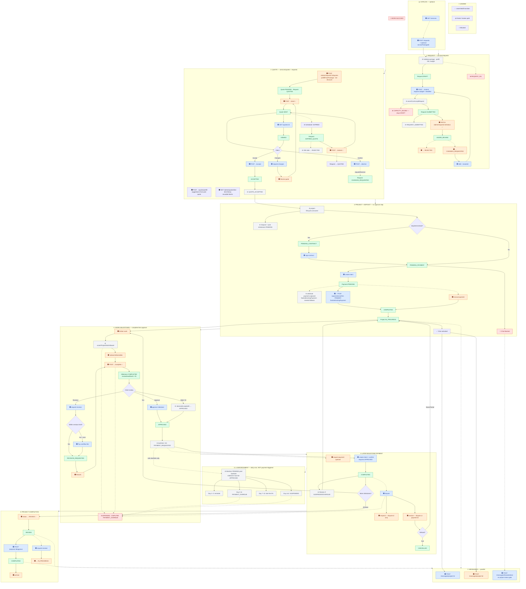

# Nestlancer — Admin ↔ Client Complete Flow

> **Canonical reference** for the full studio pipeline: catalog → request → quote → project → milestones → payments → completion.  
> **Last verified:** 2026-06-17 — independent audit of controllers, services, state machines, Prisma schemas, webhook worker, and gateway proxies.  
> Gateway: `/api/v1` · Amounts in **paise** · Async: **outbox → RabbitMQ**  
> Roles: `USER` (client) · `ADMIN` (studio operator)

---

## Legend

| Symbol | Meaning                                        |
| ------ | ---------------------------------------------- |
| 🟦     | Client action                                  |
| 🟧     | Admin action                                   |
| ⚙️     | System (scheduler, consumer, outbox)           |
| ✅     | `assertValidTransition` wired on this endpoint |
| ⚠️     | Partial, alternate, or broken path             |
| 🚫     | Work or chat blocked                           |

**Deposit vs work milestones:** Deposit (lowest `order`) is paid in phase ③ with **no** approve step — unlocks `IN_PROGRESS` + chat. Work milestones: admin **complete** → client **approve** → client **pay**.

**Payments:** Primary path is `POST /payments/confirm` → `PaymentCompletionService.finalizeExistingPayment`. Razorpay `payment.captured` webhook uses the same `finalizeExistingPayment` path (fallback when client confirm is delayed).

**Work blocking:** `assertProjectWorkAllowed` blocks deliverables + milestone complete when project is `SUSPENDED`, `DISPUTED`, or `PAYMENT_OVERDUE`.

**Messaging (send + read):** Allowed in `IN_PROGRESS`, `REVIEW`, `REVISION_REQUESTED`, `ON_HOLD`, `COMPLETED`. Blocked in `PENDING_CONTRACT`, `PENDING_PAYMENT`, `CREATED`, `CANCELLED`, `ARCHIVED`, `PAYMENT_OVERDUE`, `SUSPENDED`, `DISPUTED`.

---

## Backend mental model

Nestlancer is a **single-studio** platform: one `ADMIN` serves many `USER` clients. HTTP at the gateway (`/api/v1`) drives synchronous state changes; **async side-effects** flow through transactional outbox → RabbitMQ consumers.

| Layer      | Path                 | Port | Role in pipeline                                       |
| ---------- | -------------------- | ---- | ------------------------------------------------------ |
| Gateway    | `gateway/`           | 3000 | JWT + roles; proxies to microservices                  |
| Requests   | `services/requests`  | 3002 | Catalog, draft/submit, capacity, admin review          |
| Quotes     | `services/quotes`    | 3003 | Create/send/accept/decline/expiry                      |
| Projects   | `services/projects`  | 3004 | Auto-create from quote, contract sign, approve/archive |
| Progress   | `services/progress`  | 3005 | Milestones, deliverables, deemed acceptance            |
| Payments   | `services/payments`  | 3006 | Intent/confirm, gating, enforcement, disputes          |
| Messaging  | `services/messaging` | 3007 | Project chat + direct threads                          |
| WS Gateway | `ws-gateway/`        | 3100 | Real-time via Redis pub/sub from `MESSAGE_SENT`        |

**Entity chain:** `ProjectRequest` (1) → `Quote` (1 per request) → `Project` (1 per quote) → `Milestone[]` + `Payment[]` per milestone.

**Who owns state changes:**

| Transition                         | Owner               | Mechanism                                                             |
| ---------------------------------- | ------------------- | --------------------------------------------------------------------- |
| Request `DRAFT` → `SUBMITTED`      | requests            | Sync `submitRequest` + `REQUEST_SUBMITTED` outbox                     |
| Quote `SENT` → `ACCEPTED`          | quotes              | Sync `acceptQuote` + `QUOTE_ACCEPTED` outbox                          |
| Quote accept → Project create      | projects            | Async `project-lifecycle.consumer` → `project-from-quote.service`     |
| Deposit pay → `IN_PROGRESS`        | payments + projects | Sync `confirm` → `finalizeExistingPayment` + `PROJECT_STATUS_CHANGED` |
| Milestone `COMPLETED` → `APPROVED` | progress            | Sync `approve` → `scheduleMilestonePayment`                           |
| Overdue → `SUSPENDED`              | payments            | Cron `PaymentEnforcementService` (independent of payment flow)        |
| Project `REVIEW` → `COMPLETED`     | projects            | Sync client `approveProject`                                          |

**Cross-feature triggers (minimum set):**

| From     | To            | Event / call                                                                           |
| -------- | ------------- | -------------------------------------------------------------------------------------- |
| Quotes   | Projects      | `QUOTE_ACCEPTED` → `ProjectFromQuoteService.createFromAcceptedQuote`                   |
| Projects | Payments      | `project-payment-schedule.service` creates milestones + `Payment` rows                 |
| Progress | Payments      | `MILESTONE_APPROVED` → `scheduleMilestonePayment` sets `dueDate` + `PAYMENT_REQUESTED` |
| Payments | Projects      | `finalizeExistingPayment` → `PROJECT_STATUS_CHANGED` / `PROJECT_RESUMED`               |
| Payments | Progress      | Revision overflow pay → `REVISION_REQUESTED` on milestone                              |
| Any      | Notifications | Outbox types consumed by email/notification workers                                    |

---

## Admin ↔ Client handoffs

| Phase     | Who starts           | Other party                 | Client API                              | Admin API                                                                                         |
| --------- | -------------------- | --------------------------- | --------------------------------------- | ------------------------------------------------------------------------------------------------- |
| Catalog   | Client (optional)    | —                           | `GET /services`                         | —                                                                                                 |
| Request   | Client submits       | Admin reviews               | `POST /requests/:id/submit`             | `PATCH /admin/requests/:id/status`                                                                |
| Quote     | Admin sends          | Client accepts / negotiates | `POST /quotes/:id/accept`               | `POST /admin/requests/:id/quotes` · `POST /admin/quotes/:id/send` · reuse: §3.14 in endpoints doc |
| Contract  | System               | Client signs (if required)  | `POST /projects/:id/sign-contract`      | —                                                                                                 |
| Deposit   | Client pays          | Admin may record manually   | `POST /payments/confirm`                | `POST /admin/payments/manual`                                                                     |
| Delivery  | Admin completes work | Client approves             | `POST /progress/milestones/:id/approve` | `POST /admin/milestones/:id/complete`                                                             |
| Later pay | Client pays          | Admin may nudge             | `POST /payments/confirm`                | `POST /admin/payments/milestones/:id/request-payment`                                             |
| Sign-off  | Admin → REVIEW       | Client approves project     | `POST /projects/:id/approve`            | `PATCH /admin/projects/:id/status`                                                                |
| Dispute   | Client disputes      | Admin responds / resolves   | `POST /payments/:id/dispute`            | `POST /admin/payments/disputes/:id/respond`, `.../resolve`                                        |

---

## Complete flow diagram

---

## Happy path (17 steps)

| #   | Actor  | Action                      | Endpoint                                      | Entity status after                                                               |
| --- | ------ | --------------------------- | --------------------------------------------- | --------------------------------------------------------------------------------- |
| 0   | Client | Browse catalog (optional)   | `GET /services`                               | —                                                                                 |
| 1   | Client | Create request              | `POST /requests`                              | Request `DRAFT`                                                                   |
| 2   | Client | Submit request              | `POST /requests/:id/submit`                   | Request `SUBMITTED` (capacity checked)                                            |
| 3   | Admin  | Review (optional)           | `PATCH /admin/requests/:id/status`            | `UNDER_REVIEW`                                                                    |
| 4   | Admin  | Create quote                | `POST /admin/requests/:id/quotes`             | Quote `PENDING`, Request `QUOTED`                                                 |
| 5   | Admin  | Send quote                  | `POST /admin/quotes/:id/send`                 | Quote `SENT`                                                                      |
| 6   | Client | View quote                  | `GET /quotes/:id`                             | Quote `VIEWED`, `viewHistory` updated                                             |
| 7   | Client | Accept quote                | `POST /quotes/:id/accept`                     | Quote `ACCEPTED`                                                                  |
| 8   | System | Create project              | `QUOTE_ACCEPTED` consumer                     | Project `PENDING_PAYMENT` (or `PENDING_CONTRACT`), Request `CONVERTED_TO_PROJECT` |
| 8b  | Client | Sign contract (if required) | `POST /projects/:id/sign-contract`            | Project `PENDING_PAYMENT`                                                         |
| 9   | System | Payment schedule            | `project-payment-schedule.service`            | Milestones `PENDING`, Payments `CREATED`                                          |
| 10  | Client | Pay deposit                 | `POST /payments/create-intent` + `confirm`    | Payment `COMPLETED`, deposit milestone `IN_PROGRESS`                              |
| 11  | System | Start project               | `finalizeExistingPayment` sync                | Project `IN_PROGRESS`, chat unlocked                                              |
| 12  | Admin  | Complete milestone          | `POST /admin/milestones/:id/complete`         | Milestone `COMPLETED`                                                             |
| 13  | Client | Approve milestone           | `POST /progress/milestones/:id/approve`       | Milestone `APPROVED`, `dueDate` +3d                                               |
| 14  | Client | Pay later milestone         | `POST /payments/confirm`                      | Payment `COMPLETED`                                                               |
| 15  | Admin  | Mark for sign-off           | `PATCH /admin/projects/:id/status` → `REVIEW` | Project `REVIEW`                                                                  |
| 16  | Client | Approve project             | `POST /projects/:id/approve`                  | Project `COMPLETED`                                                               |

---

## Payment rules

| Milestone                    | Approve work first? | Admin `request-payment`?  | When paid                             | Overdue enforcement                                                                   | Restore on pay                                                    |
| ---------------------------- | ------------------- | ------------------------- | ------------------------------------- | ------------------------------------------------------------------------------------- | ----------------------------------------------------------------- |
| **Deposit** (lowest `order`) | **No**              | Not required              | Phase ③ — unlocks project + messaging | N/A (pre-work)                                                                        | N/A                                                               |
| **Later milestones**         | **Yes**             | Optional after `APPROVED` | Phase ⑤                               | `dueDate` +3d → reminder d1 → `PAYMENT_OVERDUE` d3 → late fee 5% d7 → `SUSPENDED` d14 | `SUSPENDED`/`PAYMENT_OVERDUE` → `IN_PROGRESS` + `PROJECT_RESUMED` |

**Sources:** `payment-gating.service.ts`, `milestone-approval.service.ts` (`scheduleMilestonePayment`), `payment-enforcement.service.ts`, `payment-completion.service.ts` (`restoreProjectIfOverduePayment`), `payment-terms.util.ts` (`milestonePaymentDueDays: 3`, `suspensionAfterDays: 14`, `lateFeePercent: 5`)

---

## `assertValidTransition` call sites (11)

Wired on **11** call sites — **not** every mutation. Client milestone approve, client project approve, and payment status changes use business-rule validation instead.

| #   | Entity    | Transition                                | File                                                                    |
| --- | --------- | ----------------------------------------- | ----------------------------------------------------------------------- |
| 1   | REQUEST   | \* → admin status                         | `services/requests/src/services/requests.admin.service.ts`              |
| 2–3 | QUOTE     | → SENT (send, extend)                     | `services/quotes/src/services/quotes.admin.service.ts`                  |
| 4–5 | QUOTE     | → REVISED                                 | `services/quotes/src/controllers/quotes.admin.controller.ts` (×2 paths) |
| 6–8 | QUOTE     | → ACCEPTED / DECLINED / CHANGES_REQUESTED | `services/quotes/src/services/quote-status.service.ts`                  |
| 9   | PROJECT   | admin status patch                        | `services/projects/src/services/projects.admin.service.ts`              |
| 10  | PROJECT   | admin status via progress controller      | `services/progress/src/controllers/admin/progress.admin.controller.ts`  |
| 11  | MILESTONE | → COMPLETED                               | `services/progress/src/services/milestones.service.ts`                  |

State machine definitions: `libs/common/src/state-machines/status-transitions.ts`

---

## Phase-by-phase verification log

Independent audit of every diagram node against live backend code (**2026-06-17**).

| Phase | Diagram node                                    | Status    | Source file(s)                                                                         |
| ----- | ----------------------------------------------- | --------- | -------------------------------------------------------------------------------------- |
| ⓪     | `GET /services`                                 | ✅        | `services/requests/.../services.public.controller.ts`                                  |
| ⓪     | `servicePackageId` prefill                      | ✅        | `requests.service.ts` L33–76 — `REQUEST_011` if invalid                                |
| ①     | Submit capacity `CAPACITY_001/002`              | ✅        | `admin-capacity.service.ts` `assertCanAcceptRequest`; called from `submitRequest` L251 |
| ①     | Submit requires budget + deadline               | ✅        | `requests.service.ts` `REQUEST_009`                                                    |
| ①     | `PATCH /admin/requests/:id/status` ✅           | ✅        | `requests.admin.service.ts` L83                                                        |
| ①     | `REQUEST_SUBMITTED` async                       | ✅        | `requests.service.ts` outbox on submit                                                 |
| ②     | Tier discount NEW/RETURNING/VIP                 | ✅        | `libs/common/.../client-tier.util.ts`; `quotes.admin.service.ts` (requests)            |
| ②     | Package prefill on quote create                 | ✅        | `prefillFromPackage` · `requests/.../quotes.admin.service.ts`                          |
| ②     | Quote prefill suggestions (past quote)          | ✅        | `POST /admin/requests/:id/quotes/prefill`                                              |
| ②     | Line-item library blocks                        | ✅        | `QuoteLineItemBlock` · `GET/POST/PATCH/DELETE /admin/quotes/line-item-library`         |
| ②     | Static quote templates                          | ❌ Closed | `POST /admin/quotes/templates` → 410 Gone (`CODE-GAP-003`)                             |
| ②     | Send quote ✅                                   | ✅        | `quotes.admin.service.ts` L130                                                         |
| ②     | View → `VIEWED`                                 | ✅        | `quotes.service.ts` L154–175                                                           |
| ②     | Accept → `QUOTE_ACCEPTED`                       | ✅        | `quote-status.service.ts` L31–58                                                       |
| ②     | Decline → `REJECTED` or `CHANGES_REQUESTED`     | ✅        | `quote-status.service.ts` L86–105 `requestRevision` flag                               |
| ②     | Quote expiry scheduler                          | ✅        | `quote-expiry-scheduler.service.ts`                                                    |
| ②     | Extend ✅                                       | ✅        | `quotes.admin.service.ts` L191 `EXPIRED → SENT`                                        |
| ③     | Project from quote async                        | ✅        | `project-lifecycle.consumer.ts` → `project-from-quote.service.ts`                      |
| ③     | `PENDING_CONTRACT` vs `PENDING_PAYMENT`         | ✅        | `project-from-quote.service.ts` L89 `requiresContract`                                 |
| ③     | Request → `CONVERTED_TO_PROJECT`                | ✅        | `project-from-quote.service.ts` L110–112                                               |
| ③     | Payment schedule + milestones                   | ✅        | `project-payment-schedule.service.ts`                                                  |
| ③     | Sign contract → `PENDING_PAYMENT`               | ✅        | `projects.service.ts` `signContract` · gateway `projects.controller.ts`                |
| ③     | Deposit: no approve required                    | ✅        | `payment-gating.service.ts` L117–118 `isDeposit` bypass                                |
| ③     | `confirm` PRIMARY path                          | ✅        | `payment-confirmation.service.ts` L68–80                                               |
| ③     | Manual payment full side-effects                | ✅        | `payments.admin.controller.ts` L420–434                                                |
| ③     | Webhook lifecycle via `finalizeExistingPayment` | ✅        | `payment-captured.handler.ts` + `@nestlancer/common` `PaymentCompletionService`        |
| ③     | Chat blocked until `IN_PROGRESS`                | ✅        | `project-messaging.constants.ts`; `messaging-access.service.ts`                        |
| ④     | `assertProjectWorkAllowed` on deliverables      | ✅        | `deliverables.service.ts` L24                                                          |
| ④     | Milestone complete ✅                           | ✅        | `milestones.service.ts` L90 + `reviewDeadlineAt` +7d                                   |
| ④     | Milestone approve → schedule payment            | ✅        | `milestone-approval.service.ts` `scheduleMilestonePayment`                             |
| ④     | Deemed acceptance 7d                            | ✅        | `milestone-review-scheduler.service.ts` → `processDeemedAcceptance`                    |
| ④     | Revision overflow payment                       | ✅        | `milestone-approval.service.ts` L155–182 + `payment-completion` overflow handler       |
| ⑤     | Pay gated on `APPROVED`                         | ✅        | `payment-gating.service.ts` L121–146                                                   |
| ⑤     | Admin `request-payment` requires `APPROVED`     | ✅        | `payment-gating.service.ts` `assertCanRequestPayment`                                  |
| ⑤     | Restore on pay when overdue/suspended           | ✅        | `payment-completion.service.ts` `restoreProjectIfOverduePayment`                       |
| ⑤     | Client dispute → `DISPUTED`                     | ✅        | `payments.service.ts` L187–208                                                         |
| ⑤     | Admin respond (dispute id only)                 | ✅        | `admin-tasks.service.ts` `respondToDispute` L271–313                                   |
| ⑤     | Admin resolve (dispute or payment id)           | ✅        | `admin-tasks.service.ts` `resolveDispute` L93–98                                       |
| ⑤.⑤   | Enforcement independent cron                    | ✅        | `payment-enforcement.service.ts` — not called from payment flow                        |
| ⑤.⑤   | Day thresholds d1/d3/d7/d14                     | ✅        | L86–99 + `payment-terms.util.ts` defaults                                              |
| ⑥     | Admin → `REVIEW` ✅                             | ✅        | `projects.admin.service.ts` L119                                                       |
| ⑥     | Client approve → `COMPLETED`                    | ✅        | `projects.service.ts` `approveProject`                                                 |
| ⑥     | Client request-revision → admin resume          | ✅        | `projects.service.ts` + admin status patch                                             |
| ⑦     | Messaging send + read gated                     | ✅        | `messaging.service.ts` L88, L163 `requireProjectMessagingAllowed`                      |
| ⑦     | Direct threads pre-project                      | ✅        | `requireThreadMember` — no project status gate                                         |

---

## Known code gaps (documented — not diagram errors)

| ID           | Severity | Issue                                       | Impact                                                                               | Fix location                                                                      |
| ------------ | -------- | ------------------------------------------- | ------------------------------------------------------------------------------------ | --------------------------------------------------------------------------------- |
| CODE-GAP-003 | Closed   | ~~Quote templates admin endpoints stubbed~~ | Resolved 2026-06-18 — static template CRUD rejected; use line-item library + prefill | `GET /admin/quotes/line-item-library` · `POST /admin/requests/:id/quotes/prefill` |

**Resolved (2026-06-18):** `POST /admin/payments/milestones/:id/mark-complete` now delegates to progress `POST /admin/milestones/:id/complete` (gateway + payments proxy). Prefer the progress path for new integrations.

---

## Verification summary

| Area                                      | Status      | Notes                                                                                      |
| ----------------------------------------- | ----------- | ------------------------------------------------------------------------------------------ |
| All core pipeline phases ⓪–⑦              | ✅ Verified | Every diagram node traced to source                                                        |
| Deposit vs work milestone orthogonality   | ✅          | Matches `docs/adr/001-milestone-lifecycle.md`                                              |
| Messaging read + send gate                | ✅          | `requireProjectMessagingAllowed` on POST and GET                                           |
| Dispute resolve dual id                   | ✅          | Dispute id OR payment id                                                                   |
| Dispute respond dispute id only           | ✅          | `respondToDispute` requires dispute record id                                              |
| Enforcement independence + day thresholds | ✅          | Cron separate from payment schedule                                                        |
| Razorpay webhook                          | ✅ Fixed    | Uses `finalizeExistingPayment`; lookup by `externalId` or Razorpay `order_id` → `intentId` |
| `assertValidTransition` count             | ✅          | 11 call sites confirmed                                                                    |
| Demo scenario walkthroughs                | Deferred    | Payloads in `seed/payloads/demo/`. Run with `bash seed/seed.sh --env=dev --phase=demo` |

---

## Code references

| Topic                        | Source                                                                  |
| ---------------------------- | ----------------------------------------------------------------------- |
| Payment completion           | `services/payments/src/services/payment-completion.service.ts`          |
| Payment confirm (primary)    | `services/payments/src/services/payment-confirmation.service.ts`        |
| Payment gating               | `services/payments/src/services/payment-gating.service.ts`              |
| Milestone approve + schedule | `services/progress/src/services/milestone-approval.service.ts`          |
| Overdue enforcement          | `services/payments/src/services/payment-enforcement.service.ts`         |
| Project from quote           | `services/projects/src/services/project-from-quote.service.ts`          |
| Lifecycle consumer           | `services/projects/src/consumers/project-lifecycle.consumer.ts`         |
| Messaging access             | `services/messaging/src/services/messaging-access.service.ts`           |
| State machines               | `libs/common/src/state-machines/status-transitions.ts`                  |
| Messaging allowed statuses   | `libs/common/src/constants/project-messaging.constants.ts`              |
| Payment terms defaults       | `libs/common/src/payment/payment-terms.util.ts`                         |
| Milestone lifecycle ADR      | `docs/adr/001-milestone-lifecycle.md`                                   |
| Prisma models                | `prisma/schema/{request,quote,project,payment,progress,message}.prisma` |
| Backend analysis prompt      | _(archived — see git history)_                                          |
