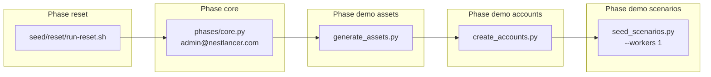
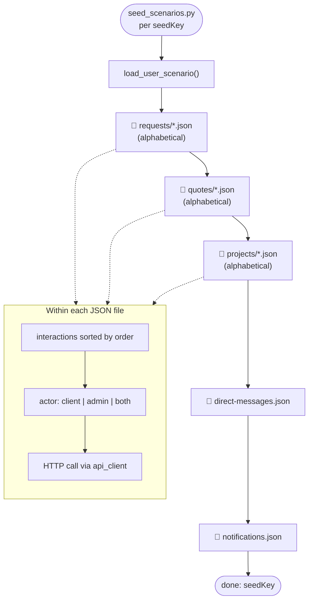
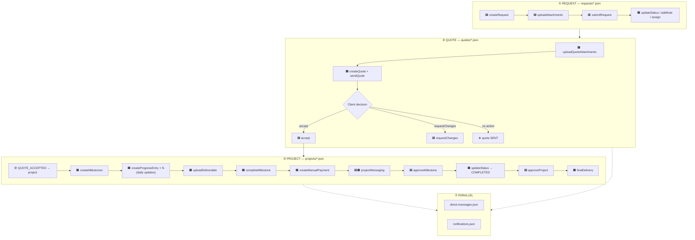
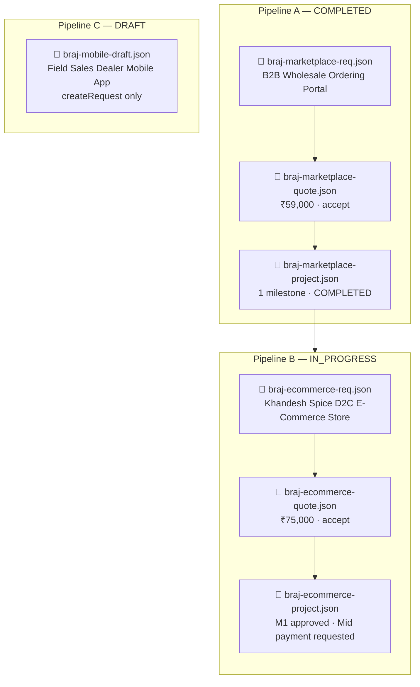
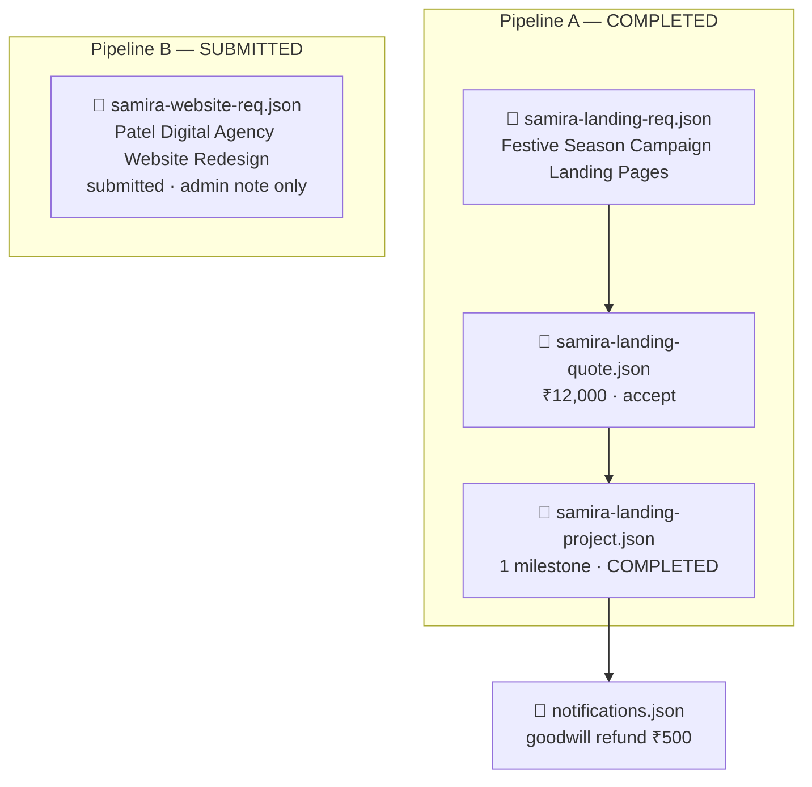
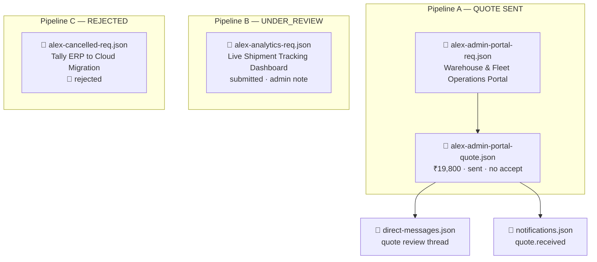
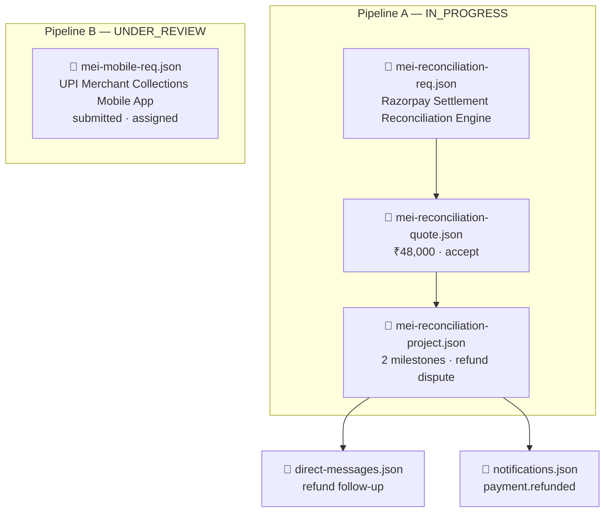
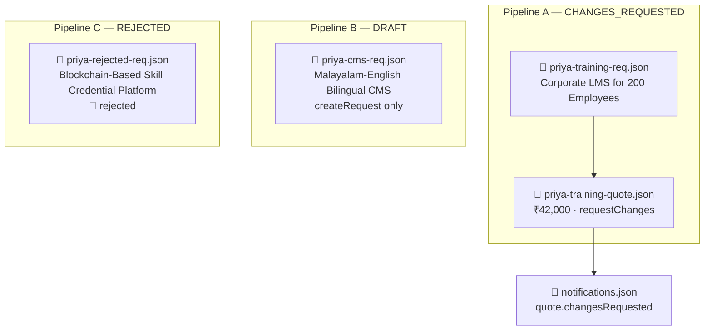
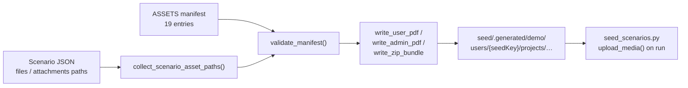

# Admin ↔ Client Data — Complete Flow

> **Purpose:** How demo JSON under `seed/payloads/demo/` becomes live database and MinIO state via real API calls.  
> **Backend reference:** [`docs/seeding/ADMIN-CLIENT-COMPLETE-FLOW.md`](../../docs/seeding/ADMIN-CLIENT-COMPLETE-FLOW.md) · [`ADMIN-CLIENT-COMPLETE-FLOW-endpoints.md`](../../docs/seeding/ADMIN-CLIENT-COMPLETE-FLOW-endpoints.md)  
> **Data root:** `seed/payloads/demo/`  
> **Runner:** [`seed/README.md`](../README.md)  
> **Last aligned with data:** 2026-07-21 (admin request/quote queue filters)

### Admin list API defaults

| Endpoint              | Default (no `status`)                      | `status=inbox`                                 | `status=all` |
| --------------------- | ------------------------------------------ | ---------------------------------------------- | ------------ |
| `GET /admin/requests` | Excludes client `draft`                    | `submitted`, `underReview`, `changesRequested` | All statuses |
| `GET /admin/quotes`   | Excludes `accepted`, `declined`, `expired` | Active pipeline quotes                         | All statuses |

Seed scripts use `status=all` when resolving entities by title across the full dataset.

---

## Legend

| Symbol | Meaning                                           |
| ------ | ------------------------------------------------- |
| 🟦     | Client action (seed script logs in as client)     |
| 🟧     | Admin action (seed script logs in as admin)       |
| ⚙️     | System / async (outbox consumer, asset generator) |
| 📄     | JSON input file                                   |
| ✅     | Present in scenario data                          |
| ⏸️     | Stops at this phase (no quote / no project yet)   |
| 🚫     | Terminal rejection                                |

**Amounts:** API payloads use **paise**; quote line items use **rupees** (server converts).

**Idempotency:** Re-runs match existing entities by **exact request title**.

---

## Seed pipeline overview

The full dev seed (`bash seed/seed.sh --env=dev`) runs reset, core, content, then demo:



| Step | Script                       | Input                                          | Output                                                          |
| ---- | ---------------------------- | ---------------------------------------------- | --------------------------------------------------------------- |
| 0    | `seed/demo/scripts/generate_assets.py` | Scenario file paths                   | `seed/.generated/demo/users/{seedKey}/…` |
| 1    | `seed/demo/scripts/create_accounts.py` | `payloads/demo/accounts/`             | `seeded-users.json` (client JWT ids)                            |
| 2    | `seed/demo/scripts/seed_scenarios.py`  | `payloads/demo/scenarios/users/{seedKey}/**` | Live requests, quotes, projects, payments, messages             |

---

## Data directory layout

```
seed/
├── seed.sh
├── README.md
├── payloads/demo/
│   ├── accounts/
│   │   ├── index.json
│   │   └── profiles/{seedKey}.json
│   └── scenarios/
│       ├── index.json
│       └── users/{seedKey}/
│           ├── meta.json
│           ├── requests/*.json
│           ├── quotes/*.json
│           ├── projects/*.json
│           ├── direct-messages.json
│           └── notifications.json
└── demo/
    ├── admin-client-data-complete-flow.md
    └── scripts/
        ├── generate_assets.py
        ├── create_accounts.py
        ├── seed_scenarios.py
        └── lib/scenario_loader.py
```

---

## Scenario runner — execution order

`scenario_loader.py` processes **each client** in this file order:



**Within a single pipeline** (one request → quote → project chain), files link via `requestSeedKey` and `quoteSeedKey` fields — not file order alone.

---

## Interaction phase map (as used in data)

| Phase                 | JSON location          | Key actions in data                                                                                                                                                                                                          | API endpoint                                                                                   |
| --------------------- | ---------------------- | ---------------------------------------------------------------------------------------------------------------------------------------------------------------------------------------------------------------------------- | ---------------------------------------------------------------------------------------------- |
| ① Request             | `requests/*.json`      | `createRequest`, `uploadAttachments`, `submitRequest`                                                                                                                                                                        | `POST /requests`, `POST /requests/:id/attachments`, `POST /requests/:id/submit`                |
| ① Admin review        | `requests/*.json`      | `updateStatus`, `addNote`, `assign`                                                                                                                                                                                          | `PATCH /admin/requests/:id/status`, `POST …/notes`, `POST …/assign`                            |
| ② Quote               | `quotes/*.json`        | `uploadQuoteAttachments`, `createQuote`, `sendQuote`                                                                                                                                                                         | `POST /media/upload/request`, `POST /admin/requests/:id/quotes`, `POST /admin/quotes/:id/send` |
| ② Client decision     | `quotes/*.json`        | `accept`, `requestChanges`                                                                                                                                                                                                   | `POST /quotes/:id/accept`, `POST /quotes/:id/request-changes`                                  |
| ③ Project             | `projects/*.json`      | ⚙️ auto-create on accept                                                                                                                                                                                                     | `QUOTE_ACCEPTED` consumer                                                                      |
| ③–⑥ Project lifecycle | `projects/*.json`      | `updateStatus`, `createMilestones`, `createProgressEntry`, `uploadDeliverable`, `completeMilestone`, `createManualPayment`, `processRefund`, `approveMilestone`, `approveProject`, `requestProjectRevision`, `finalDelivery` | See [`interaction-types/README.md`](data/scenarios/interaction-types/README.md)                |
| ⑦ Direct chat         | `direct-messages.json` | `directThread`                                                                                                                                                                                                               | `POST /messages/threads/direct`                                                                |
| ⑦ Project chat        | `projects/*.json`      | `projectMessaging`                                                                                                                                                                                                           | `POST /messages/project/:id`                                                                   |
| System                | `notifications.json`   | `sendNotification`                                                                                                                                                                                                           | `POST /admin/notifications/send`                                                               |

---

## Master entity flow (one request pipeline)

Every **complete** request → quote → project chain follows this shape in the JSON data:



---

## Five clients — scenario map

| seedKey        | Display name | Email                         | Requests | Quotes | Projects | Messaging             |
| -------------- | ------------ | ----------------------------- | -------- | ------ | -------- | --------------------- |
| `braj-wave`    | Arjun Mehta  | `arjun.mehta@nestlancer.com`  | 3        | 2      | 2        | —                     |
| `samira-patel` | Samira Patel | `samira.patel@nestlancer.com` | 2        | 1      | 1        | notification          |
| `alex-rivera`  | Rahul Desai  | `rahul.desai@nestlancer.com`  | 3        | 1      | —        | direct + notification |
| `mei-chen`     | Ananya Iyer  | `ananya.iyer@nestlancer.com`  | 2        | 1      | 1        | direct + notification |
| `priya-nair`   | Priya Nair   | `priya.nair@nestlancer.com`   | 3        | 1      | —        | notification          |

---

## Client 1 — Arjun Mehta (`braj-wave`)

**Company:** Mehta Wholesale Traders · **City:** Ahmedabad  
**Summary:** Completed B2B dealer portal · active spice D2C store · draft field-sales app



| File                        | Request title                       | End state                                                            |
| --------------------------- | ----------------------------------- | -------------------------------------------------------------------- |
| `braj-marketplace-req.json` | B2B Wholesale Ordering Portal       | → quote → project **COMPLETED**                                      |
| `braj-ecommerce-req.json`   | Khandesh Spice D2C E-Commerce Store | → quote → project **IN_PROGRESS** (M1 approved, Mid installment due) |
| `braj-mobile-draft.json`    | Field Sales Dealer Mobile App       | **DRAFT** (no submit)                                                |

**Pipeline A highlights:** 2× daily progress entries · manual payment UTR HDFC20260715001 · project chat · client testimonial · final zip delivery.

**Pipeline B highlights:** 3 milestones (30/40/30) · 2× daily progress entries · M1 wireframes · ₹22,500 advance paid · checkout-first messaging for Navratri launch.

---

## Client 2 — Samira Patel (`samira-patel`)

**Company:** Patel Digital Marketing · **City:** Mumbai  
**Summary:** Completed festive campaign pages · agency website redesign in queue



| File                      | Request title                         | End state                       |
| ------------------------- | ------------------------------------- | ------------------------------- |
| `samira-landing-req.json` | Festive Season Campaign Landing Pages | → quote → project **COMPLETED** |
| `samira-website-req.json` | Patel Digital Agency Website Redesign | **SUBMITTED** (no quote yet)    |

**Pipeline A highlights:** Navratri / Diwali / gifting pages · Zoho CRM + GA4 · 2× daily progress · full payment ICICI UTR · goodwill refund ₹500 · in-app notification.

---

## Client 3 — Rahul Desai (`alex-rivera`)

**Company:** Desai Logistics Solutions · **City:** Pune  
**Summary:** Warehouse portal quote pending · shipment dashboard in review · Tally migration rejected



| File                         | Request title                       | End state         |
| ---------------------------- | ----------------------------------- | ----------------- |
| `alex-admin-portal-req.json` | Warehouse & Fleet Operations Portal | Quote **SENT** ⏸️ |
| `alex-analytics-req.json`    | Live Shipment Tracking Dashboard    | **UNDER_REVIEW**  |
| `alex-cancelled-req.json`    | Tally ERP to Cloud Migration        | **REJECTED** 🚫   |

**Messaging:** Direct thread about warehouse portal quote · in-app `quote.received` notification.

---

## Client 4 — Ananya Iyer (`mei-chen`)

**Company:** Iyer FinServ Pvt Ltd · **City:** Bengaluru  
**Summary:** Razorpay reconciliation in progress · duplicate payment refunded · UPI app under review



| File                          | Request title                             | End state                          |
| ----------------------------- | ----------------------------------------- | ---------------------------------- |
| `mei-reconciliation-req.json` | Razorpay Settlement Reconciliation Engine | → quote → project **IN_PROGRESS**  |
| `mei-mobile-req.json`         | UPI Merchant Collections Mobile App       | **UNDER_REVIEW** (assigned to ops) |

**Pipeline A highlights:** 2 milestones · 2× daily progress (webhook + outbox) · duplicate ₹500 payment + refund · 5-message project chat with PR attachment · client `requestProjectRevision` on replay UI.

---

## Client 5 — Priya Nair (`priya-nair`)

**Company:** Nair Learning Systems · **City:** Kochi  
**Summary:** Draft bilingual CMS · LMS quote with change requests · blockchain credentials rejected



| File                      | Request title                              | End state                          |
| ------------------------- | ------------------------------------------ | ---------------------------------- |
| `priya-training-req.json` | Corporate LMS for 200 Employees            | Quote sent → **CHANGES_REQUESTED** |
| `priya-cms-req.json`      | Malayalam-English Bilingual CMS            | **DRAFT**                          |
| `priya-rejected-req.json` | Blockchain-Based Skill Credential Platform | **REJECTED** 🚫                    |

**Quote change requests:** Split CMS add-on · extend Okta SAML milestone · add HR completion dashboard.

---

## Coverage matrix — interaction types used

| Action                      | braj-wave | samira | rahul | ananya | priya |
| --------------------------- | --------- | ------ | ----- | ------ | ----- |
| `createRequest`             | ✅×3      | ✅×2   | ✅×3  | ✅×2   | ✅×3  |
| `uploadAttachments`         | ✅×2      | ✅×1   | ✅×1  | ✅×1   | ✅×1  |
| `submitRequest`             | ✅×2      | ✅×2   | ✅×2  | ✅×2   | ✅×2  |
| `updateStatus` (request)    | ✅×2      | ✅×1   | ✅×2  | ✅×2   | ✅×2  |
| `assign`                    | ✅×1      | —      | —     | ✅×1   | —     |
| `addNote`                   | —         | ✅×1   | ✅×1  | ✅×1   | —     |
| `createQuote` + `sendQuote` | ✅×2      | ✅×1   | ✅×1  | ✅×1   | ✅×1  |
| `accept`                    | ✅×2      | ✅×1   | —     | ✅×1   | —     |
| `requestChanges`            | —         | —      | —     | —      | ✅×1  |
| `createMilestones`          | ✅×2      | ✅×1   | —     | ✅×1   | —     |
| `createProgressEntry`       | ✅×4      | ✅×2   | —     | ✅×2   | —     |
| `uploadDeliverable`         | ✅×2      | ✅×1   | —     | ✅×1   | —     |
| `completeMilestone`         | ✅×2      | ✅×1   | —     | —      | —     |
| `createManualPayment`       | ✅×3      | ✅×1   | —     | ✅×2   | —     |
| `processRefund`             | —         | ✅×1   | —     | ✅×1   | —     |
| `projectMessaging`          | ✅×2      | ✅×1   | —     | ✅×1   | —     |
| `approveMilestone`          | ✅×2      | ✅×1   | —     | —      | —     |
| `approveProject`            | ✅×1      | ✅×1   | —     | —      | —     |
| `finalDelivery`             | ✅×1      | ✅×1   | —     | —      | —     |
| `requestProjectRevision`    | —         | —      | —     | ✅×1   | —     |
| `directThread`              | —         | —      | ✅×1  | ✅×1   | —     |
| `sendNotification`          | —         | ✅×1   | ✅×1  | ✅×1   | ✅×1  |

---

## Generated assets flow

`generate_assets.py` builds PDFs/zips referenced in scenario JSON before step 2 runs:



| Client       | Asset count | Types                                                               |
| ------------ | ----------- | ------------------------------------------------------------------- |
| Arjun Mehta  | 7           | request brief, quote proposal, deliverables, final zip ×2 pipelines |
| Samira Patel | 4           | request brief, quote, designs PDF, final zip                        |
| Rahul Desai  | 2           | request brief, quote proposal                                       |
| Ananya Iyer  | 4           | request brief, quote, webhook spec, PR markdown                     |
| Priya Nair   | 2           | request brief, quote proposal                                       |

---

## End-state summary (after full seed)

| Client           | Projects created | Notable terminal states                                                                  |
| ---------------- | ---------------- | ---------------------------------------------------------------------------------------- |
| **Arjun Mehta**  | 2                | B2B portal **COMPLETED** · Spice D2C **IN_PROGRESS** (M1 done) · Mobile app **DRAFT**    |
| **Samira Patel** | 1                | Campaign pages **COMPLETED** · Website redesign awaiting quote                           |
| **Rahul Desai**  | 0                | Warehouse quote **SENT** · Shipment dashboard in review · Tally migration **REJECTED**   |
| **Ananya Iyer**  | 1                | Reconciliation **IN_PROGRESS** (refund resolved, revision requested) · UPI app in review |
| **Priya Nair**   | 0                | LMS quote **CHANGES_REQUESTED** · CMS **DRAFT** · Blockchain **REJECTED**                |

**Totals:** 5 clients · 14 requests · 6 quotes · 4 projects · 10 daily progress entries · 4 direct/project chat threads · 4 in-app notifications · 19 generated asset files.

---

## Run commands

```bash
# Full pipeline (reset, core, content, demo)
bash seed/seed.sh --env=dev

# Demo only, after core is already loaded
bash seed/seed.sh --env=dev --phase=demo --skip-export

# Or step by step
python3 seed/demo/scripts/generate_assets.py
python3 seed/demo/scripts/create_accounts.py
python3 seed/demo/scripts/seed_scenarios.py --workers 1
```

---

## Related files

| File                                                                                             | Role                                                      |
| ------------------------------------------------------------------------------------------------ | --------------------------------------------------------- |
| [`../README.md`](../README.md)                                                                   | Run guide                                                 |
| [`scripts/lib/scenario_loader.py`](scripts/lib/scenario_loader.py)                               | JSON assembly and file ordering                           |
| [`docs/seeding/ADMIN-CLIENT-COMPLETE-FLOW.md`](../../docs/seeding/ADMIN-CLIENT-COMPLETE-FLOW.md) | Backend state machine (source of truth for API behaviour) |
